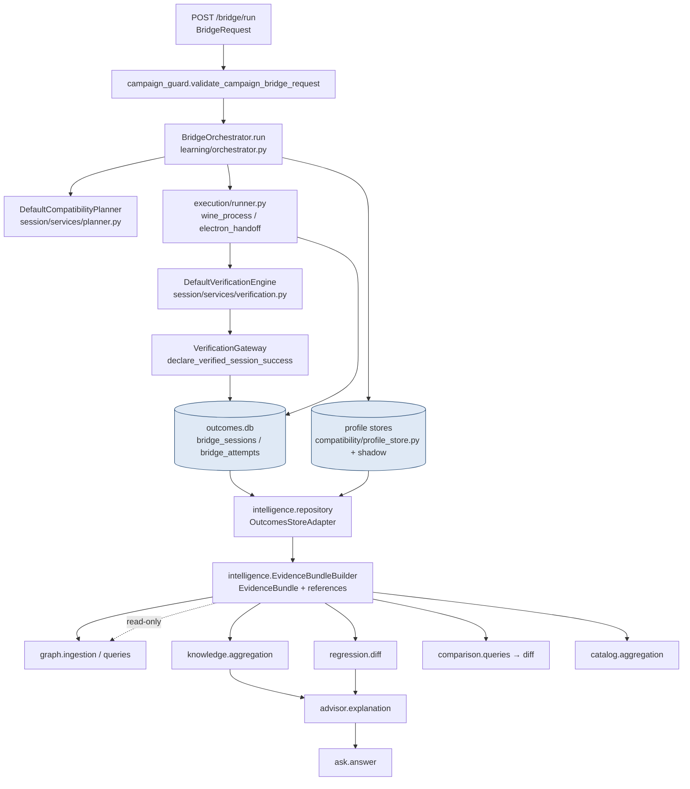

# Alma Bridge — Data Flow

**Status:** Phase 1 Architecture Audit (documentation only)
**Companion:** [LAYER_DIAGRAM](./LAYER_DIAGRAM.md) · [DEPENDENCY_GRAPH](./DEPENDENCY_GRAPH.md)

This document traces how data moves from a launch attempt to the read-only advisory surfaces, and enumerates the persistent stores.

---

## 1. End-to-end flow (write path → read path)

**Write authority** stops at the `outcomes.db` / profile stores. Everything from `intelligence.repository` rightward is **read-only**: it opens the same SQLite files for SELECT-only access and never writes.

---

## 2. The canonical evidence record

`storage/outcomes.py` owns `data/outcomes.db` (path from `settings.db_path`). Schema (with online column migrations in `_SESSION_COLUMN_MIGRATIONS` / `_ATTEMPT_COLUMN_MIGRATIONS`):

- **`bridge_sessions`** — `session_id` (PK), `file_path`, `file_hash` (application fingerprint), `started_at`, `finished_at`, `success`, `hardware_profile`, `summary`, `rerank_events`, plus migrated columns: `session_state`, `parent_session_id`, `correlation_id`, `inspection_json`, `policy_context_json`, `escalation_json`, `session_timeout_at`, `lease_owner_id`, `lease_expires_at`, `run_environment_json`.
- **`bridge_attempts`** — `id` (PK), `session_id` (FK), `attempt_number`, `strategy_id`, `remediation_id`, `runtime`, `command`, `env`, `mode`, `success`, `exit_code`, `error_signature`, `detected_error`, `stdout`, `stderr`, `duration_ms`, `created_at`, plus migrated: `phase`, `parent_attempt_number`, `route_id`, `policy_decision_json`, `verification_json`, `state_fingerprint`, `escalation_kind`.
- **`import_log`** — dedupe log for legacy imports.

Indexes: `idx_attempts_session`, `idx_attempts_signature`, `idx_attempts_strategy`, `idx_sessions_path`.

**Application identity** across the read-only tier is keyed on `bridge_sessions.file_hash` (`list_sessions_for_fingerprint`). This is a known Phase-1 limitation (hash equality, not a full program-identity graph key) — noted in `docs/architecture/alma-bridge-platform-direction.md` and ADR-002.

---

## 3. Persistent stores inventory

| Store / file | Owner module | Purpose | Written by | Read by |
|--------------|--------------|---------|-----------|---------|
| `data/outcomes.db` | `storage/outcomes.py` | Sessions + attempts + import log (**authoritative evidence**) | orchestrator, execution, routes | all read-only layers via `intelligence.repository` |
| Compatibility profile DB | `compatibility/profile_store.py` (`_connect`) | Compatibility profiles + candidates | profile creation / manifest capture | `intelligence.repository` (profile candidate reads) |
| Shadow prediction/comparison | `compatibility/profile_shadow_store.py` | Shadow predictions + candidates | shadow mode | `intelligence.repository` (`get_shadow_prediction/comparison`) |
| Shadow validation store | `compatibility/profile_shadow_validation_store.py`, `_analyzer/_export/_reporter` | Validation campaign labels + gates | validation CLI/campaigns | `/compatibility/shadow/validation/*` |
| Profile metrics / lineage | `compatibility/profile_metrics.py`, `profile_lineage.py` | Metrics + lineage/provenance | profile subsystem | reporting |
| Healing store | `compliance/learning.py` (`init_healing_store`) | Self-healing feedback | autopilot | `/compliance/autopilot/feedback` |
| Automation stores | `automation/approval.py`, `agent.py`, `sessions.py` | Approvals, agents, automation sessions | automation spine | `/automation/*` |
| Remediation learning | `learning/remediation_learning.py`, `training.py`, `datasets.py` | Outcome stats / ranker training data | training | ranker |
| Model artifacts | `data/models/strategy_ranker.joblib` / `.json` | Trained strategy ranker | `/train/ranker` | planner ranking |
| Compliance program DB | `compliance/program.py` | Retention / audit data | automation | `/compliance/program/*` |
| Legacy import sources | `importers/sysdet.py` (external `alma.db`), resolve audit dir | Legacy scan/resolve | — (external) | `/import/*` |

There is **no single database abstraction layer** — each subsystem manages its own `sqlite3.connect(...)` and schema. This is the largest data-architecture risk (see [ARCHITECTURE_REPORT](./ARCHITECTURE_REPORT.md) R1).

---

## 4. Evidence bundle assembly (the read-path primitive)

`intelligence/evidence.py::EvidenceBundleBuilder` is the shared entry point that every read-only layer builds on (directly in `catalog`, `comparison`; transitively via knowledge/regression elsewhere). For a session or fingerprint it emits an `EvidenceBundle` of:

- `references`: typed `EvidenceReference`s (SESSION, INSPECTION, ATTEMPT, VERIFICATION, FRAMEWORK_DETECTION, MANIFEST_CAPTURE, SHADOW_COMPARISON, RUN_ENVIRONMENT).
- `artifacts`: keyed payloads (`attempt:{sid}:{n}`, `verification:{sid}:{n}`, `run_environment:{sid}`, …).

Downstream layers then re-shape this bundle:
- `comparison/queries.py` → `SessionEvidenceSnapshot` (environment + verification + frameworks + runtimes).
- `knowledge/aggregation.py` → knowledge records with per-field provenance.
- `regression/diff.py` → baseline vs current.
- `catalog/aggregation.py` → catalog rows.

**Duplication note:** `EvidenceBundleBuilder._framework_from_attempt` re-implements wxWidgets/Qt string-match heuristics that also exist in `compatibility/framework_detection.py`. Framework/provenance derivation is therefore duplicated between the core detector and the evidence builder (technical debt TD3).

---

## 5. Determinism & provenance

- Verification-pass is the single authoritative fact; both write and read paths gate on `aggregate_verification_passed()` (`session/stop_on_success_verification.py`). `exit_code==0` / `success=1` alone are explicitly **not** treated as verified success (ADR-001/002).
- Provenance is carried as `EvidenceReference` / `KnowledgeEvidenceReference` objects and per-field evidence maps (`evidence_by_field`) so advisories can cite the exact artifact. Two reference types exist (intelligence vs knowledge) and are bridged via a **private** method call in `comparison/queries.py` (`_to_knowledge_ref`) — see [PACKAGE_BOUNDARIES](./PACKAGE_BOUNDARIES.md) §2.
