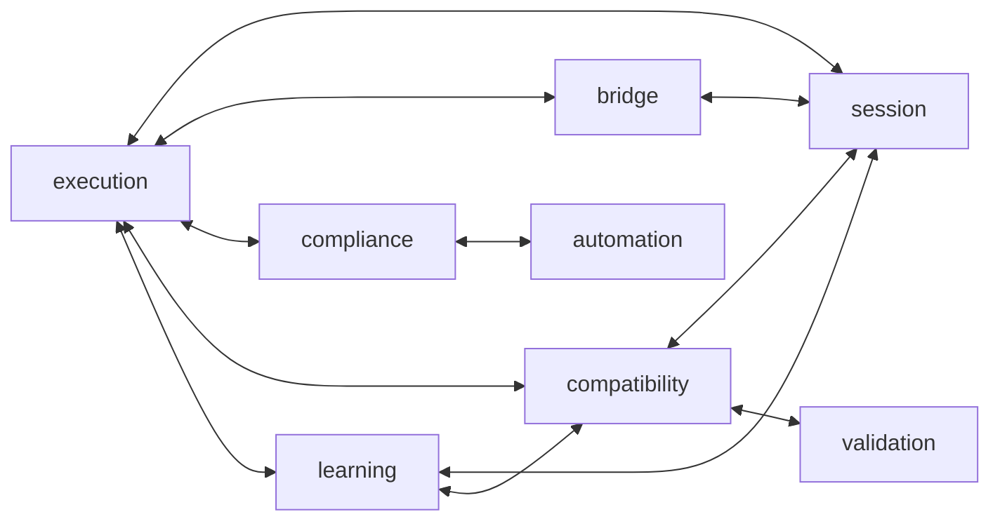

# Alma Bridge — Dependency Graph

**Status:** Phase 1 Architecture Audit (documentation only)
**Method:** static AST scan of every `alma_bridge/**/*.py`, collapsed to top-level package edges (importer → imported). Relative imports within a package are excluded.
**Companion:** [IMPORT_GRAPH](./IMPORT_GRAPH.md) (file-level evidence) · [PACKAGE_BOUNDARIES](./PACKAGE_BOUNDARIES.md)

---

## 1. Top-level package edges (as measured)

The following edges were extracted directly from the source. `__root__` = modules directly under `alma_bridge/` (`main.py`, `flagship.py`, `config.py`).

| Importer | Imports (top-level packages) |
|----------|------------------------------|
| `__root__` | api, automation, compliance, config, operator, storage |
| `advisor` | compatibility, config, graph, knowledge, regression |
| `api` | advisor, ask, automation, bridge, catalog, comparison, compatibility, compliance, config, execution, flagship, graph, hardware, importers, intelligence, knowledge, learning, observability, operator, regression, schemas, session, storage, validation |
| `ask` | advisor, config, knowledge, regression |
| `automation` | compliance, config, execution, flagship, hardware, learning, schemas |
| `bridge` | compatibility, compliance, config, execution, hardware, schemas, session, storage |
| `catalog` | intelligence, knowledge, regression, storage |
| `cli` | compatibility, storage, validation |
| `comparison` | compatibility, graph, intelligence, knowledge, regression, session |
| `compatibility` | config, execution, hardware, learning, schemas, session, validation |
| `compliance` | automation, config, execution, hardware |
| `execution` | bridge, compatibility, compliance, config, hardware, learning, schemas, session, storage |
| `graph` | compatibility, config, intelligence |
| `importers` | config, execution, hardware, learning, storage |
| `intelligence` | compatibility, storage |
| `knowledge` | compatibility, graph, intelligence, session |
| `learning` | bridge, compatibility, config, execution, hardware, schemas, session, storage |
| `observability` | learning, storage |
| `operator` | automation, compliance, config, execution, hardware, learning, session, storage |
| `regression` | compatibility, intelligence, knowledge |
| `session` | automation, bridge, compatibility, compliance, config, execution, hardware, learning, schemas, storage |
| `storage` | compatibility, config |
| `validation` | compatibility, config, execution, learning, schemas, storage |

---

## 2. Read-only tier subgraph (clean, downstream-only)

```mermaid
flowchart LR
    intelligence --> graph
    intelligence --> knowledge
    intelligence --> regression
    intelligence --> comparison
    intelligence --> catalog
    graph --> knowledge
    graph --> comparison
    graph --> advisor
    knowledge --> regression
    knowledge --> comparison
    knowledge --> advisor
    knowledge --> ask
    knowledge --> catalog
    regression --> comparison
    regression --> advisor
    regression --> ask
    regression --> catalog
    advisor --> ask
    comparison --> session_pred[session.stop_on_success_verification]
    knowledge --> session_pred

    classDef smell fill:#fdecea,stroke:#b71c1c;
    class session_pred smell;
```

**Observation:** within layers 3–9 the dependency arrows are acyclic and strictly downstream. The only red edge is the shared pure predicate in `session` (see §4).

---

## 3. Core tier subgraph (tangled — many cycles)



Every `<-->` is a **confirmed mutual (2-node) import cycle** at package granularity. These are currently made importable through **deferred / function-local imports** (e.g. `main.py` imports `operator` inside `_lifespan`, `storage/outcomes.py` imports `compatibility.profile_store` inside `init_outcome_store`, `api/routes.py` imports planner/operator inside handlers). See [ARCHITECTURE_REPORT](./ARCHITECTURE_REPORT.md) risk R2.

Detected mutual cycles:

- `execution ↔ session`
- `execution ↔ bridge`
- `execution ↔ compliance`
- `execution ↔ compatibility`
- `execution ↔ learning`
- `compliance ↔ automation`
- `learning ↔ session`
- `learning ↔ compatibility`
- `compatibility ↔ session`
- `compatibility ↔ validation`
- `bridge ↔ session`

(Longer >2-node cycles also exist by transitivity; the mutual pairs above are the tightest and most actionable.)

---

## 4. Cross-tier edges from read-only → core

| Edge | File evidence | Nature | Verdict |
|------|---------------|--------|---------|
| `knowledge → session` | `alma_bridge/knowledge/aggregation.py:24` `from alma_bridge.session.stop_on_success_verification import aggregate_verification_passed` | pure predicate import | Smell (relocate) |
| `comparison → session` | `alma_bridge/comparison/queries.py:15` same symbol | pure predicate import | Smell (relocate) |

No read-only package imports `learning.orchestrator`, `session.verification_gateway`, `session.mutations`, `execution.*`, `automation.*`, or `operator.*`. This is verified both by the AST scan above and by per-package boundary tests.

---

## 5. `api` is the universal aggregator

`api` imports **24** packages — it is the single composition root that wires every subsystem into HTTP routes. This is expected for a router layer, but `alma_bridge/api/routes.py` is a 1,255-line monolith mixing Bridge, Compliance, Modernization, Automation, Operator, and Container concerns (the eight read-only routers are already split into their own files). Splitting `routes.py` by tag is recommended in [V1.2_WORK_PLAN](./V1.2_WORK_PLAN.md) Phase 2.
