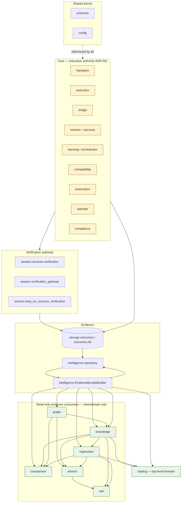
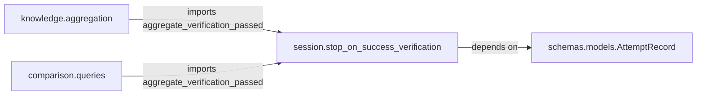

# Alma Bridge — Layer Diagram

**Status:** Phase 1 Architecture Audit (documentation only)
**Companion:** [SYSTEM_OVERVIEW](./SYSTEM_OVERVIEW.md) · [DEPENDENCY_GRAPH](./DEPENDENCY_GRAPH.md) · [READ_ONLY_BOUNDARIES](./READ_ONLY_BOUNDARIES.md)

This document maps the audit brief's conceptual layer chain onto the concrete packages under `alma_bridge/`, and shows the strict **downstream-only** evidence flow.

---

## 1. Conceptual layers → packages

| # | Layer (brief) | As-built package(s) | Authority |
|---|---------------|----------------------|-----------|
| 0 | Shared kernel | `schemas/`, `config.py` | referenced by all |
| 1 | **Execution** | `execution/`, `bridge/`, `learning/` (orchestrator, ranker), `automation/`, `operator/`, `compliance/`, `hardware/`, `compatibility/` (planner, strategies, preflight) | mutates prefixes, launches processes |
| 2 | **Verification** | `session/services/verification.py`, `session/verification_gateway.py`, `session/stop_on_success_verification.py`, `compatibility/expected_verification_contract.py`, `compatibility/verification_binding_compatibility.py` | sole `SUCCEEDED` authority (ADR-001) |
| 3 | **Evidence** | `storage/outcomes.py`, `validation/campaign_evidence.py`, `compatibility/profile_manifest_capture.py`, `intelligence/evidence.py` (`EvidenceBundleBuilder`), `intelligence/repository.py` | read/persist evidence; read-only from step 3 onward |
| 4 | **Compatibility Graph** | `graph/` (`ingestion.py`, `queries.py`, `repository.py`, `models.py`, `service.py`) | read-only, evidence-derived (ADR-003) |
| 5 | **Knowledge** | `knowledge/` (`aggregation.py`, `queries.py`, `repository.py`, `models.py`, `service.py`) | read-only aggregation (ADR-004) |
| 6 | **Regression** | `regression/` (`diff.py`, `queries.py`, `repository.py`, `models.py`, `service.py`) | read-only baseline compare (ADR-005) |
| 7 | **Comparison** | `comparison/` (`diff.py`, `queries.py`, `service.py`, `models.py`) | read-only session diff (ADR-009) |
| 8 | **Advisor** | `advisor/` (`explanation.py`, `context.py`, `service.py`) + `advisor/llm/` | read-only, deterministic; optional LLM render (ADR-006) |
| 9 | **Ask Alma** | `ask/` (`classifier.py`, `context.py`, `answer.py`, `service.py`, `policy.py`) | read-only Q&A (ADR-007) |
| ⊕ | **Catalog** (top-level browser) | `catalog/` (`aggregation.py`, `repository.py`, `service.py`, `models.py`) | read-only app browser (ADR-008) |
| ⊗ | Interface | `api/`, `cli/`, `observability/` | HTTP/CLI/metrics |

---

## 2. Downstream-only layer diagram



**Reading rule:** arrows point in the direction of a permitted `import` / data dependency (downstream). There are **no arrows from the read-only tier back into `CORE`** except the single pure-function edge described below.

---

## 3. The one backward-looking edge (documented smell)



`session.stop_on_success_verification.aggregate_verification_passed()` is a pure predicate (no I/O, no subprocess, no orchestrator) but it physically lives in the **core** `session` package. Two read-only packages import it. Boundary tests pass because the forbidden fragments target `orchestrator` / `verification_gateway` / `session.mutations`, not this module. Recommended relocation to a neutral module is captured in [READ_ONLY_BOUNDARIES](./READ_ONLY_BOUNDARIES.md) and Phase 3 of the [work plan](./V1.2_WORK_PLAN.md).

---

## 4. Vertical authority rule (ADR-001)

```
          declare_verified_session_success()  ◄── ONLY session.verification_gateway
                        ▲
   VERIFYING state ─────┘  (BridgeOrchestrator, learning/orchestrator.py)
                        ▲
   prefix mutation ─────┘  requires PolicyGate + prefix_lock (session/mutations.py)
```

Nothing in layers 3–9 (Evidence → Ask) may cross this line. This is asserted by `tests/test_verification_authority.py`, `tests/test_orchestrator_authority.py`, and each package's boundary test.
