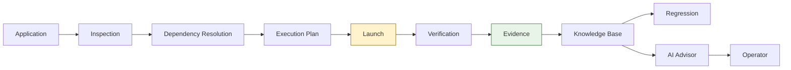
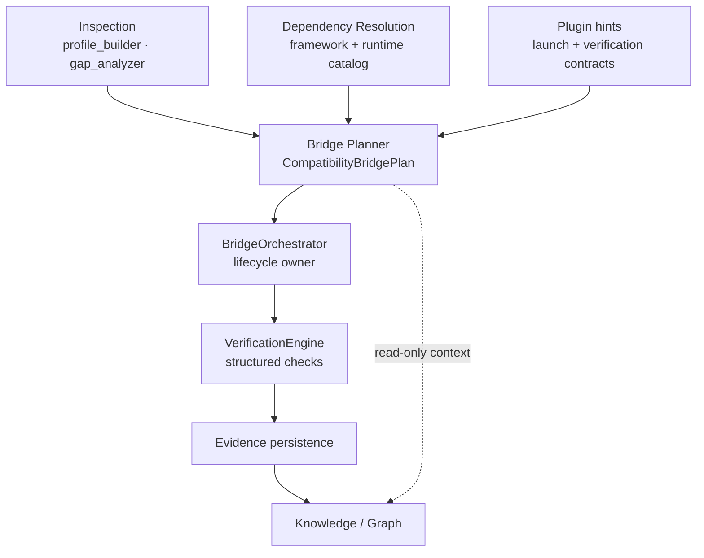

# Alma Bridge — Windows Compatibility Platform Direction

**Status:** Architectural direction (documentation only — no product behavior changes)  
**Last updated:** 2026-07-27  
**Audience:** Engineers, operators, product stakeholders, and technical leadership  
**Related documents:**

- [Development Progress Overview](../progress/alma-bridge-progress-overview.md) — what is proven today
- [Next Development Phase Roadmap](../roadmap/alma-bridge-next-phase.md) — prioritized engineering work
- [ADR-001: Authoritative Bridge Lifecycle](../adr/ADR-001-authoritative-bridge-lifecycle.md) — non-negotiable execution law
- [ADR-002: Compatibility Intelligence Boundary](../adr/ADR-002-compatibility-intelligence-boundary.md) — read-only assessment layer

---

## How to read this document

Alma Bridge is a **Windows Compatibility Platform**, not a Wine launcher with features bolted on. This document states the long-term architectural philosophy: what Alma *is*, how its parts relate, and which invariants must never be violated as the system grows.

If you are new to the codebase, read the [progress overview](../progress/alma-bridge-progress-overview.md) first for concrete proof points (Code::Blocks verified launch, shadow validation campaigns). Return here for the *why* behind those engineering choices.

---

## Core philosophy

Every Windows application on Linux raises the same fundamental question:

> **What must be true about this host environment for this application to run correctly?**

Alma Bridge exists to answer that question **deterministically** — with inspectable evidence, a structured plan, guarded execution, and verified outcomes — rather than through trial-and-error launcher heuristics.

| Principle | Plain language | Technical expression |
|-----------|----------------|----------------------|
| **Understanding before action** | Figure out what the app needs before changing anything | Inspection → dependency resolution → plan before first launch attempt |
| **Deterministic execution** | Same inputs produce the same plan | Versioned engines (`dep_resolve_v1`, `profile_shadow_rank_v1`), stable JSON ordering, no hidden ML overrides in the execution path |
| **Verification before success** | “It started” is not “it works” | `VerificationEngine` aggregate policy must pass before any session reaches `SUCCEEDED` ([ADR-001](../adr/ADR-001-authoritative-bridge-lifecycle.md)) |
| **Evidence over memory** | What happened last time informs humans; it does not silently control the next run | Knowledge Database and CompatibilityProfile shadow mode are **read-only relative to execution** until explicit promotion gates pass |
| **Platform, not launcher** | Alma builds compatibility infrastructure; individual app fixes are evidence, not architecture | No app-specific orchestrator branches; framework and launcher families integrate through plugins |

The closed-loop proof — Code::Blocks 25.03 reaching `SUCCEEDED` only after structured verification — demonstrates this philosophy in practice. See [progress overview §9](../progress/alma-bridge-progress-overview.md#9-codeblocks-breakthrough).

---

## Shift from features to capabilities

Feature-oriented thinking produces one-off fixes: “add wxWidgets support,” “handle Electron handoff,” “fix Code::Blocks.” Capability-oriented thinking produces **permanent platform infrastructure** that any application can use.

Alma Bridge organizes around **nine permanent capabilities**. These are not roadmap items to check off and retire — they are the enduring surface area of the platform.

| # | Capability | What it does (plain language) | Primary codebase touchpoints (today) |
|---|------------|-------------------------------|--------------------------------------|
| 1 | **Application Discovery** | Find and fingerprint the Windows program to run | `build_compatibility_inspection()` in `alma_bridge/bridge/profile_builder.py`; `GET /bridge/inspect` in `alma_bridge/api/routes.py` |
| 2 | **Classification** | Determine program kind (installer, GUI, Electron, console, …) and route to the correct execution family | `alma_bridge/compatibility/program_kind.py`; orchestrator kind routing in `alma_bridge/learning/orchestrator.py` |
| 3 | **Dependency Resolution** | Infer required frameworks, DLLs, and runtimes from binary evidence and prefix state | `alma_bridge/compatibility/framework_detection.py` (wxWidgets today); proposed `dependency_resolution.py` in [roadmap Priority 1](../roadmap/alma-bridge-next-phase.md#priority-1--dependency-resolution-engine) |
| 4 | **Environment Construction** | Build or mutate the Wine prefix safely — runtimes, registry, DLL overrides | `alma_bridge/execution/preflight.py`; `run_prefix_mutation()` in `alma_bridge/session/mutations.py`; prefix lock in `alma_bridge/session/prefix_lock.py` |
| 5 | **Execution Planning** | Merge inspection, gaps, dependencies, and strategy into a deterministic launch plan | `DefaultCompatibilityPlanner` in `alma_bridge/compatibility/planner.py`; target model `CompatibilityBridgePlan` in `alma_bridge/schemas/bridge_domain.py` |
| 6 | **Verified Execution** | Run the plan under lifecycle authority and declare success only after verification | `BridgeOrchestrator` in `alma_bridge/learning/orchestrator.py`; `DefaultVerificationEngine` in `alma_bridge/session/services/verification.py`; `VerificationGateway` in `alma_bridge/session/verification_gateway.py` |
| 7 | **Evidence Collection** | Capture structured artifacts from every attempt — verification JSON, manifests, shadow comparisons | `alma_bridge/storage/outcomes.py`; `alma_bridge/validation/campaign_evidence.py`; `alma_bridge/compatibility/profile_manifest_capture.py` |
| 8 | **Knowledge Management** | Store, query, and relate compatibility knowledge without controlling execution | Profile store (`alma_bridge/compatibility/profile_store.py`); shadow validation (`alma_bridge/compatibility/profile_shadow.py`); proposed KB in [roadmap Priority 2](../roadmap/alma-bridge-next-phase.md#priority-2--compatibility-knowledge-database) |
| 9 | **Operator Experience** | Give humans visibility, explanation, and safe control — never silent automation | Shadow validation CLI (`alma_bridge/cli/shadow_validation.py`); proposed Explorer and AI Advisor in [roadmap Priorities 5–6](../roadmap/alma-bridge-next-phase.md#priority-5--compatibility-explorer) |

**The test for any new work:** Does it strengthen a permanent capability, or does it add a one-off feature? Features may ship first as expedients; capabilities are where they must land.

---

## Separate core from platform

Alma Bridge has two layers with a strict authority boundary.

### Core (execution authority)

The core owns the **closed loop** from classification through verified success. Nothing outside the core may declare compatibility success or mutate prefixes without passing through core gates.

| Core component | Module(s) | Responsibility |
|----------------|-----------|----------------|
| Classification | `program_kind.py`, `framework_detection.py` | Route program to execution family |
| Dependency resolution | (proposed) `dependency_resolution.py`, `runtime_catalog.py` | Pre-execution requirement inference |
| Planner | `compatibility/planner.py`, `bridge/profile_builder.py`, `bridge/gap_analyzer.py` | Produce `CompatibilityBridgePlan` |
| Orchestrator | `learning/orchestrator.py` | Sole lifecycle owner for `/bridge/run` |
| Verification | `session/services/verification.py` | Aggregate evidence; own verification semantics |
| Session & policy | `session/lifecycle.py`, `session/policy.py` (`PolicyGate`), `session/verification_gateway.py` | State machine, mutation approval, sole `SUCCEEDED` path |

**Core must not contain:**

- UI rendering or Explorer panels
- AI/LLM inference loops
- Cloud sync or remote configuration that overrides local plans
- App-specific heuristics (`if codeblocks`, `if ascension`) — these belong in plugins or are legacy debt to migrate

### Platform (evidence consumers)

The platform surrounds the core. It **reads evidence** produced by verified and failed runs; it **never controls execution**.

| Platform surface | Purpose | Authority |
|------------------|---------|-----------|
| **Compatibility Knowledge Database** | Structured app/runtime/framework records | Read-only for orchestrator; ingestion on finalize |
| **Compatibility Explorer** | Operator inspection UI/API | Strictly read-only — no `/bridge/run` side effects |
| **AI Compatibility Advisor** | Explain failures with cited evidence | No `ActionIntent` emission; no plan reordering |
| **Regression Validation** | Verified apps as permanent test citizens | Runs through core lifecycle; compares to baselines |
| **Plugin SDK** | Register detectors, installers, verifiers, planners | Plugins return plans and evidence — not terminal success |
| **Analytics** | Aggregate success rates, campaign metrics | Display-only hints with sample-size caveats |
| **Cloud Sync** (future) | Share evidence and baselines across hosts | Sync knowledge, not execution authority |

```
┌─────────────────────────────────────────────────────────────┐
│                      PLATFORM LAYER                          │
│  KB · Explorer · AI Advisor · Regression · Analytics · Sync │
│         reads evidence ──────────────────► never executes    │
└───────────────────────────┬─────────────────────────────────┘
                            │ evidence up
                            ▼
┌─────────────────────────────────────────────────────────────┐
│                        CORE LAYER                            │
│  Classify → Resolve → Plan → Orchestrate → Verify → Persist  │
│              ADR-001 lifecycle authority                     │
└─────────────────────────────────────────────────────────────┘
```

CompatibilityProfile shadow mode (`alma_bridge/compatibility/profile_shadow.py`) sits at the boundary: it **predicts** before planning but, by design, **never applies** predictions to execution while `ALMA_BRIDGE_COMPATIBILITY_PROFILE_REUSE_ENABLED=false`.

---

## Compatibility Intelligence — Phase 1 Foundation

**Status:** Implemented (2026-07-27)  
**Module:** `alma_bridge/intelligence/`  
**ADR:** [ADR-002](../adr/ADR-002-compatibility-intelligence-boundary.md)

Phase 1 introduces a deterministic, read-only assessment layer that consumes persisted bridge evidence and emits structured compatibility intelligence without entering the execution authority boundary.

### Boundaries

| Rule | Enforcement |
|------|-------------|
| Read-only | No writes, subprocess, prefix mutation, or orchestrator invocation |
| No execution control | Never emits `ActionIntent` or calls `VerificationGateway` |
| No LLM | Assessment is rule-based (`compatibility_intelligence_v1`) |
| Prohibited imports | orchestrator, verification_gateway, prefix mutations, winetricks, runtime installers |

### Inputs (evidence sources)

- Bridge sessions and attempts (`outcomes.db`)
- Persisted verification JSON on attempts
- Framework detection artifacts (from stderr, inspection, or attempt metadata — not live re-detection)
- Manifest capture snapshots (when profile candidates exist)
- Shadow prediction and comparison records (labeled as non-authoritative)

### Fact vs hypothesis

| Output | Meaning | Example |
|--------|---------|---------|
| **Fact (proven)** | Cited evidence satisfies conservative rules | `verified_successful_launch` only when verification aggregate `passed=True` |
| **Fact (observed)** | Persisted artifact observation, not launch proof | `uses_framework: wxwidgets` from runtime log |
| **Hypothesis** | Unresolved question with supporting/contradicting evidence | Runtime package requirements after verified launch |
| **Not a fact** | Shadow predictions, exit_code zero alone, route success | Listed in limitations, never promoted |

`exit_code == 0` and attempt `success=1` **do not** prove verified launch. Only aggregate verification pass authorizes the `verified_successful_launch` fact.

### Confidence

`ConfidencePolicy` applies transparent weights (`verified_fact`, `observed_fact`, open-hypothesis penalty, conflict penalty) to produce a `ConfidenceSummary`. Weights are returned in API responses for operator auditability.

### API (read-only)

| Endpoint | Returns |
|----------|---------|
| `GET /bridge/intelligence/sessions/{session_id}` | Session-scoped `CompatibilityAssessment` |
| `GET /bridge/intelligence/applications/{fingerprint}` | Application-scoped assessment (sessions matched by `file_hash`) |

`404` when no evidence exists. `422` with structured detail for malformed persisted evidence.

### Limitations (Phase 1)

- Application fingerprint queries correlate via `file_hash`, not full program-identity graph keys
- Framework evidence depends on persisted artifacts; live PE re-inspection is out of scope
- Manifest capture completeness varies for pre-`manifest_capture_v2` profiles
- No Knowledge Database ingestion loop yet — assessments are computed on demand

---

## Everything should produce evidence

Execution is **temporary**. Evidence is **permanent**.

Every stage of the compatibility lifecycle must emit structured, versioned artifacts that downstream systems — Knowledge Database, Explorer, regression baselines, AI Advisor — can consume without re-running the application.

### Lifecycle and evidence flow



| Stage | Evidence produced | Persistence (today / target) |
|-------|-------------------|------------------------------|
| Application | Program fingerprint, PE path, hash | Session metadata in `outcomes.db` |
| Inspection | `CompatibilityInspection`, gap list | `/bridge/inspect` response; session attach |
| Dependency resolution | `DependencyResolutionResult`, runtime requirements | Session metadata; KB ingestion (target) |
| Execution plan | `CompatibilityBridgePlan`, `ActionIntent` list | Plan preview API; session attach (target: orchestrator input) |
| Launch | `ExecutionEvidence`, stdout/stderr excerpts, process observations | Attempt record in `outcomes.db` |
| Verification | `VerificationResult`, check-level results, contract ID | Attempt verification JSON; `VerificationGateway` audit trail |
| Evidence bundle | Campaign exports, manifest capture (`manifest_capture_v2`) | `campaign_evidence.py`; `profile_manifest_capture.py` |
| Knowledge Base | App identity, launch methods, runtime records, known issues | Proposed KB tables ([roadmap Priority 2](../roadmap/alma-bridge-next-phase.md#priority-2--compatibility-knowledge-database)) |
| Regression | Baseline vs current diff, pass/fail report | Regression registry (target) |
| AI Advisor | Cited explanation with evidence IDs | Advisor API response — ephemeral, re-derivable from KB |
| Operator | Labels, promotion gate evaluations, runbook artifacts | Shadow validation exports under `data/validation/evidence/` |

**Design rule:** If a subsystem cannot point to the evidence record it produced, it is not finished.

---

## Compatibility graph

The **Compatibility Graph** is Alma Bridge’s canonical knowledge representation — not a flat database of app names, but a connected model of everything that affects whether an application runs.

### Node types

| Node | Examples | Source |
|------|----------|--------|
| **Application** | Code::Blocks 25.03, fingerprint `sha256:…` | Discovery, `ProgramProfile` |
| **Framework** | wxWidgets 3.2.7, Electron, Qt | `framework_detection.py`, detector plugins |
| **Runtime** | VC++ 2015–2022, .NET 4.8, Vulkan | Dependency resolution, prefix probes |
| **Plugin** | `wxwidgets_detector_v1`, `wine_gui_process_v1` | Plugin registry (target) |
| **Verification contract** | `bridge_aggregate_v1`, phase-specific checks | `VerificationContract` in `bridge_domain.py` |
| **Launch strategy** | `wine_gui`, `electron_handoff`, native | `compatibility/strategies.py` |
| **Prefix requirement** | Windows version, DLL overrides, registry keys | Gap analyzer, manifest capture |
| **Historical evidence** | Verified session, failed attempt, shadow comparison | `outcomes.db`, campaign evidence |
| **Regression baseline** | Frozen verification + manifest for a verified app | Regression registry (target) |

### Edge types (illustrative)

```
Application ──requires──► Runtime (VC++ redist)
Application ──uses──────► Framework (wxWidgets)
Application ──verified_by─► VerificationContract (wine_gui_process_v1)
Application ──launched_via► LaunchStrategy (wine_gui)
Framework ──detected_by───► Plugin (wxwidgets_detector)
LaunchStrategy ──needs────► PrefixRequirement (win10, msvcp140 override)
VerifiedSession ──feeds────► HistoricalEvidence ──informs──► RegressionBaseline
HistoricalEvidence ──ingests► KnowledgeBase node
```

The Compatibility Graph connects subsystems that today are fragmented:

- **Knowledge Database** stores graph nodes and edges with provenance
- **Compatibility Explorer** renders subgraphs for an application
- **Dependency resolver** traverses `requires` edges to build installation plans
- **Bridge Planner** selects launch strategies and verification contracts from graph context (read-only hints — never silent override)
- **Plugins** register themselves as graph contributors (detector, installer, verifier)

Shadow validation adds **prediction vs actual** edges: what the profile system *would* have chosen versus what the orchestrator *did* choose — essential evidence for promotion gates without controlling execution.

---

## Planner as center

The **Bridge Planner** is the architectural center of Alma Bridge. It is the single place where understanding becomes action — where inspection, dependency resolution, gap analysis, and plugin hints merge into one deterministic artifact consumed by the orchestrator.

### Target flow



### Role separation

| Component | Decides | Executes | Validates |
|-----------|---------|----------|-----------|
| **Bridge Planner** | What to run, with what environment, under which verification contract | — | — |
| **BridgeOrchestrator** | Lifecycle transitions, retry/escalation policy | Launches processes, applies preflight mutations via `PolicyGate` | Routes to verification |
| **VerificationEngine** | Whether evidence satisfies the contract | — | Pass/fail per check; aggregate policy |

**Today’s gap (honest):** The planner role is split. `DefaultCompatibilityPlanner` produces strategy-ranked `ExecutionPlan` objects; the rich `CompatibilityBridgePlan` schema exists in `alma_bridge/schemas/bridge_domain.py` but is **not yet wired as orchestrator input**. Dependency resolution is partial (wxWidgets PE imports only). The [next-phase roadmap](../roadmap/alma-bridge-next-phase.md) treats planner integration as the critical convergence point.

**Target invariant:** The orchestrator receives a fully specified `CompatibilityBridgePlan` before its first execution attempt. Ad-hoc orchestrator branches shrink to lifecycle dispatch and plugin delegation.

---

## Expand plugin boundaries

Plugins extend the platform without bloating the core. Each plugin family corresponds to a capability boundary.

| Plugin type | Capability served | Contract (illustrative) | Current state |
|-------------|--------------------|-------------------------|---------------|
| **Framework detector** | Classification + Dependency resolution | `detect(pe_path) → FrameworkDetection` | wxWidgets only in `framework_detection.py` |
| **Dependency resolver extension** | Dependency resolution | Catalog rules for runtime signatures | Heuristic by program kind in `profile_builder.py` |
| **Runtime installer** | Environment construction | `can_satisfy(requirement) → InstallStep[]` | Imperative winetricks in `preflight.py` |
| **Launch planner** | Execution planning | `plan_launch(ctx) → LaunchPlanFragment` | Hardcoded strategies in `strategies.py`; Electron/wine_gui handoff modules |
| **Verification strategy** | Verified execution | `verification_contract(ctx) → VerificationContract` | Monolithic routing in `DefaultVerificationEngine` |
| **Knowledge provider** | Knowledge management | Ingest/query graph nodes with provenance | Profile store, shadow store — no unified provider interface |
| **AI provider** | Operator experience | Cited advisory from evidence bundle only | Not built |

### Plugin rules (non-negotiable)

1. Plugins **return plans, fragments, and evidence** — never call `VerificationGateway.declare_verified_session_success()`.
2. Plugins **cannot bypass** `PolicyGate` or `prefix_lock`.
3. Plugins declare **`plugin_id` + version** for regression and KB provenance.
4. No dynamic loading from untrusted paths in v1 — explicit registry at startup.
5. Adding support for a new framework (Unity, Qt, Steam launcher) requires **zero edits to `orchestrator.py`** after migration.

See [roadmap Priority 4](../roadmap/alma-bridge-next-phase.md#priority-4--plugin-architecture) for the proposed registry design and migration path (wxWidgets, wine_gui, Electron extraction).

---

## Preserve architectural invariants

These invariants apply to **every** capability, plugin, and platform surface. They codify lessons from Pilot-001 (622-attempt runaway loop, primary prefix mutation) and pre-ADR-001 false-positive success.

### Execution authority

| Invariant | Requirement | Reference |
|-----------|-------------|-----------|
| **VerificationEngine is authoritative** | No session reaches `SUCCEEDED` unless orchestrator enters `VERIFYING`, `VerificationEngine` returns structured `VerificationResult`, aggregate policy passes, result is persisted, and `VerificationGateway.declare_verified_session_success()` transitions state | [ADR-001](../adr/ADR-001-authoritative-bridge-lifecycle.md); `session/services/verification.py`; `session/verification_gateway.py` |
| **BridgeOrchestrator owns lifecycle** | Sole driver of `/bridge/run`; no route service or child session may finalize success | ADR-001; `learning/orchestrator.py` |
| **Never bypass Bridge Planner or VerificationEngine** | Dependency resolution, runtime injection, and launch routing produce **plans and evidence inputs** — not terminal success decisions | ADR-001 prohibited patterns; this document |
| **Escalation preserves lineage** | Same `session_id`; no orphan child bridge sessions; escalation retries still pass through `VERIFYING` | ADR-001; `SessionLeaseManager` |

### Safety and determinism

| Invariant | Requirement | Reference |
|-----------|-------------|-----------|
| **Prefix mutations are guarded** | All prefix writes require `PolicyGate` approval and `prefix_lock` ownership via `run_prefix_mutation()` | ADR-001; `session/mutations.py`; `session/prefix_lock.py` |
| **No app-specific orchestration code** | App families integrate through **plugins** and structured contracts — not inline orchestrator branches | ADR-001; legacy Ascension entries in `remediation.py` are debt to migrate |
| **Deterministic planning inputs** | Same PE + prefix state → same resolution and plan output (versioned, stable JSON) | Roadmap Priority 1 acceptance criteria |
| **Modular and testable** | Each subsystem exposes deterministic inputs/outputs and unit tests; disposable-prefix workflows for mutations | `tests/test_architecture_invariants.py`, `tests/test_verification_authority.py` |

### Learning and platform boundaries

| Invariant | Requirement | Reference |
|-----------|-------------|-----------|
| **Profile reuse disabled until promoted** | Shadow predictions never control execution; active reuse stays behind feature flag and promotion gates | `config.py` (`compatibility_profile_reuse_enabled=False`); `profile_shadow.py` |
| **Knowledge and AI are non-executing** | KB, Explorer, and AI Advisor are **informational**; they never mutate prefixes, select strategies, or declare success | This document; roadmap Priorities 2, 5, 6 |
| **Historical success does not authorize current success** | `get_prior_success()` informs planning context; it does not bypass verification | ADR-001 migration notes |
| **PrefixReadinessProfile is not a compatibility profile** | TTL readiness cache only — not a substitute for verified compatibility evidence | ADR-001; `bridge/prefix_profile.py` |

### ADR-001 prohibited patterns (summary)

1. `finalize_session(success=True)` outside `VerificationGateway`
2. Direct `SUCCEEDED` transitions outside the verified-success path
3. Child bridge sessions for internal escalation
4. Recursive `BridgeOrchestrator` construction in route executors
5. Unguarded prefix mutation
6. Treating route-level success as session-level success
7. Using prior-success lookup to bypass current verification
8. Inline success decisions in orchestrator execution paths

---

## Long-term vision

Alma Bridge becomes the **deterministic Windows compatibility platform** for Linux — the system operators trust to answer “will this application run?” with reproducible evidence, not folklore.

### Near term (current roadmap phase)

- Wire `CompatibilityBridgePlan` as orchestrator input; converge split planner implementations
- Build dependency resolution engine and prefix snapshot system for safe environment construction
- Extract proven paths (wxWidgets, wine_gui, Electron) into plugins
- Stand up Compatibility Graph schema via Knowledge Database ingestion
- Register Code::Blocks as first regression citizen

### Medium term

- Compatibility Explorer gives operators full graph visibility for any fingerprinted application
- AI Advisor explains failures exclusively through cited evidence bundles
- Verified applications accumulate as permanent regression suite members
- Shadow validation campaigns (Pilot-005+) reach promotion volume gates for informed reuse decisions
- Plugin SDK enables third-party framework and launcher contributions without core changes

### Long term

- **Any Windows application** can be fingerprinted, inspected, planned, executed, and verified through the same closed loop — specialized behavior lives in plugins, not core branches
- **Compatibility Graph** spans hosts: cloud sync shares evidence and baselines, not execution authority
- **Conservative learning**: CompatibilityProfile reuse activates only when validation evidence proves ranking safety; until then, profiles enrich Explorer and Advisor
- **Continuous proof**: A compatibility claim is valid only when regression verification passes on a disposable or snapshotted prefix — anecdotal success is not platform knowledge

The measure of success is not “how many apps launch,” but “how reproducibly and verifiably Alma can make them launch — and how well it explains when they cannot.”

---

## Related documents

| Document | Relationship |
|----------|--------------|
| [Progress overview](../progress/alma-bridge-progress-overview.md) | Chronological proof of what works today |
| [Next-phase roadmap](../roadmap/alma-bridge-next-phase.md) | Engineering priorities mapped to capabilities |
| [ADR-001](../adr/ADR-001-authoritative-bridge-lifecycle.md) | Execution law — overrides all other design docs |
| [CompatibilityProfile design](../design/compatibility-profile-design.md) | Profile and shadow mode detail |
| [Architecture review](../reviews/compatibility-profile-architecture-review.md) | Phase 2 shadow subsystem analysis |
| [Shadow validation runbook](../operations/shadow-validation-runbook.md) | Operator campaign workflow |

---

*This document describes architectural direction only. Implementation must not bypass ADR-001, enable profile reuse without promotion approval, or mutate production prefixes without snapshot and campaign guards.*
