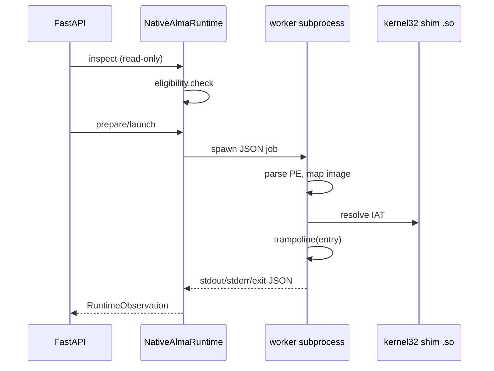

# Native Alma Runtime — Milestone 1 Architecture

## Approach A (selected)

User-space PE loader with a narrow Alma-owned Win32 API shim, executed in an
**isolated subprocess** (never inside FastAPI/Uvicorn).

| Host | PE format | Behavior |
|------|-----------|----------|
| x86_64 | PE32+ (AMD64) | Map with `mmap`, apply relocations, patch IAT to `ms_abi` shims, invoke entry via C trampoline |
| x86_64 | PE32 (i386) | Same loader in 32-bit worker when available; else fail-closed (`REASON_NO_32BIT_WORKER`) |
| other | any | Fail-closed (`REASON_HOST_ARCH`) |

**Rejected**: QEMU user emulation, Wine delegation, Unicorn or other heavy emulators.

## Package layout

```
alma_bridge/native_runtime/
├── models.py, eligibility.py, errors.py, runtime.py, tracing.py, worker.py
├── pe/          headers, parser, sections, relocations, imports
├── loader/      image, memory, entrypoint
├── process/     environment, command_line, handles, exit
├── console/     stdout, stderr
├── filesystem/  paths, files
├── api/         kernel32, ntdll (stub)
└── shim/        kernel32_shim.c, trampoline.c (compiled to .so by build script)
```

## Execution flow



## Eligibility

Two paths (either suffices):

1. **Fixture allow-list** — basename in `FIXTURE_ALLOWLIST` (conformance fixtures).
2. **Strict PE checks** — console subsystem, AMD64 or i386, no TLS/delay-load,
   no GUI/COM/.NET indicators, imports ⊆ `{kernel32.dll}`.

## Configuration

| Setting | Default | Purpose |
|---------|---------|---------|
| `native_runtime_enabled` | `false` | Master switch for native provider execution |
| `allow_experimental_runtimes` | `false` | Secondary gate for experimental providers |

Both must be true for `prepare`/`launch`/`observe` execution paths.

## Orchestrator gap (M1)

Full `/bridge/run` orchestrator wiring for `native_alma_console` strategy is
minimal: `planner_bridge` annotates plans when `native_alma_console` strategy is
requested and flags pass. Conformance runner extended to launch via provider for
fixture baselines. Complete orchestrator delegation remains Milestone 6.

## Security

See [native-runtime-threat-model.md](../security/native-runtime-threat-model.md).

## Testing

See [native-runtime-conformance.md](../testing/native-runtime-conformance.md).
