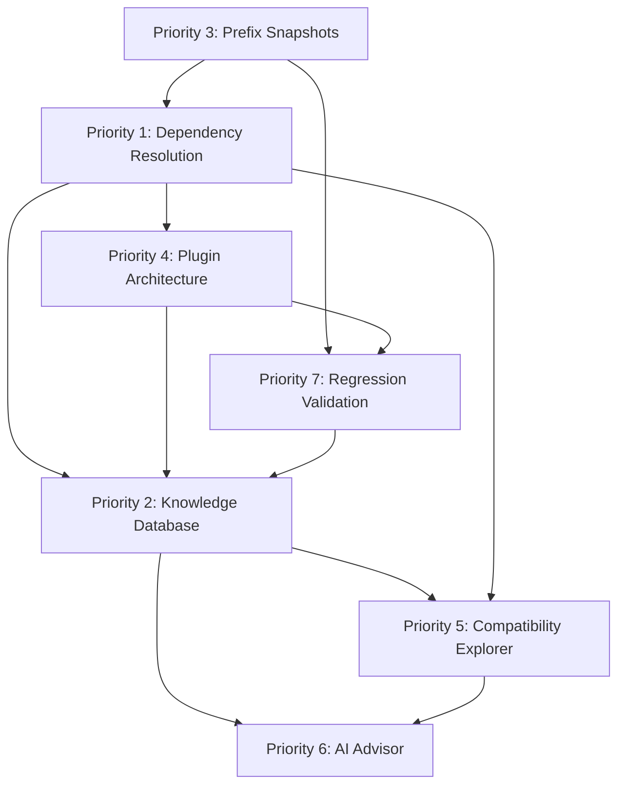

# Alma Bridge — Next Development Phase Roadmap

**Status:** Planning document (documentation only — no product behavior changes)  
**Last updated:** 2026-07-27  
**Audience:** Engineers, operators, and technical stakeholders  
**Platform direction:** [**Alma Bridge — Windows Compatibility Platform Direction**](../architecture/alma-bridge-platform-direction.md) — core philosophy, nine capabilities, core/platform boundary, Compatibility Graph, and planner-centric target flow  
**Related context:** [Alma Bridge Development Progress Overview](../progress/alma-bridge-progress-overview.md)

---

## Executive context

Alma Bridge is a **Windows Compatibility Platform**, not a Wine launcher with features. Every priority below strengthens a permanent **capability** (see [platform direction § Shift from features to capabilities](../architecture/alma-bridge-platform-direction.md#shift-from-features-to-capabilities)) while preserving ADR-001 execution authority. The **Bridge Planner** is the convergence point where inspection, dependency resolution, and plugin hints merge into a deterministic `CompatibilityBridgePlan` consumed by the orchestrator — see [platform direction § Planner as center](../architecture/alma-bridge-platform-direction.md#planner-as-center).

Alma Bridge has proven its **closed-loop execution pipeline** on a real application: **Code::Blocks 25.03** (wxWidgets 3.2.7) reached `SUCCEEDED` only after `VerificationEngine` passed structured checks — classify → framework-aware routing → launch → observe → verify → stop on success → persist evidence. See [progress overview §9–§10](../progress/alma-bridge-progress-overview.md#9-codeblocks-breakthrough).

In parallel, **CompatibilityProfile Phase 2 shadow mode** is complete and operational: predictions are created pre-plan, compared post-run, and scored through validation campaigns (Pilot-001 through Pilot-004). **Active profile reuse remains deliberately disabled** (`ALMA_BRIDGE_COMPATIBILITY_PROFILE_REUSE_ENABLED=false`). Shadow mode is observe-only; promotion volume gates are not met. See [progress overview §1, §7, §10](../progress/alma-bridge-progress-overview.md#10-current-state--proven-vs-still-under-validation).

The next development phase extends the **proven execution path** with deterministic dependency resolution, safe prefix mutation, modular plugins, structured knowledge, operator visibility, advisory AI, and regression validation — without bypassing ADR-001 lifecycle authority or enabling profile reuse prematurely. Structured outputs feed the **Compatibility Graph** — the canonical knowledge model connecting KB, Explorer, dependency resolver, and plugins ([platform direction § Compatibility Graph](../architecture/alma-bridge-platform-direction.md#compatibility-graph)).

---

## Capability mapping

The seven development priorities below map onto the platform's [nine permanent capabilities](../architecture/alma-bridge-platform-direction.md#shift-from-features-to-capabilities). Priorities are engineering work items; capabilities are the enduring platform surface.

| Capability | Roadmap priority(ies) | Notes |
|------------|----------------------|-------|
| **Application Discovery** | (existing — no dedicated priority) | `build_compatibility_inspection()`, `/bridge/inspect`; feeds planner input |
| **Classification** | Priority 4 (Plugin Architecture) | `program_kind.py`; framework detectors become plugins |
| **Dependency Resolution** | **Priority 1** | Core pre-execution engine; feeds Bridge Planner |
| **Environment Construction** | **Priority 3** (Prefix Snapshots) | Safe prefix mutation foundation for runtime injection |
| **Execution Planning** | Priorities 1, 4; planner integration cross-cutting | Target: `CompatibilityBridgePlan` as orchestrator input |
| **Verified Execution** | Priority 4 (verification plugins) | ADR-001 authority preserved; orchestrator + `VerificationEngine` unchanged in role |
| **Evidence Collection** | **Priority 7** (Regression); cross-cutting | `campaign_evidence.py`, manifest capture, verification JSON |
| **Knowledge Management** | **Priority 2** (Knowledge Database) | Compatibility Graph storage; shadow/profile evidence ingestion |
| **Operator Experience** | **Priorities 5, 6** (Explorer, AI Advisor) | Read-only and advisory — never execution authority |

**Planner-centric target flow:** Inspection + Dependency Resolution → **Bridge Planner** → `CompatibilityBridgePlan` → BridgeOrchestrator → VerificationEngine → Evidence → Compatibility Graph → (Regression · AI Advisor · Operator).

---

## Architectural constraints (hard invariants)

These are non-negotiable for every priority in this roadmap. Violating them creates the class of defects documented in Pilot-001 (runaway retries, prefix mutation) and pre-ADR-001 false-positive success.

| Invariant | Requirement | Authoritative reference |
|-----------|-------------|-------------------------|
| **VerificationEngine is authoritative** | No session reaches `SUCCEEDED` unless orchestrator enters `VERIFYING`, `VerificationEngine` returns structured `VerificationResult`, aggregate policy passes, result is persisted, and `VerificationGateway.declare_verified_session_success()` transitions state. | [ADR-001](../adr/ADR-001-authoritative-bridge-lifecycle.md); `alma_bridge/session/services/verification.py`; `alma_bridge/session/verification_gateway.py` |
| **BridgeOrchestrator owns lifecycle** | Sole driver of `/bridge/run`; no route service or child session may finalize success. | ADR-001; `alma_bridge/learning/orchestrator.py` |
| **Profile reuse disabled until promoted** | Shadow predictions never control execution; active reuse stays behind feature flag and promotion gates. | `alma_bridge/config.py` (`compatibility_profile_reuse_enabled=False`); `alma_bridge/compatibility/profile_shadow.py` |
| **Never bypass Bridge Planner or VerificationEngine** | Dependency resolution, runtime injection, and launch routing produce **plans and evidence inputs** — not terminal success decisions. | ADR-001 prohibited patterns; this roadmap |
| **Prefix mutations are guarded** | All prefix writes require `PolicyGate` approval and `prefix_lock` ownership via `run_prefix_mutation()`. | ADR-001; `alma_bridge/session/mutations.py`; `alma_bridge/session/prefix_lock.py` |
| **No app-specific orchestration code** | App families (Electron, wxWidgets, game launchers) integrate through **plugins** and structured contracts — not inline orchestrator branches. | ADR-001; existing remediation debt (Ascension-specific entries in `remediation.py`) is legacy to migrate |
| **Modular and testable** | Each new subsystem exposes deterministic inputs/outputs, unit tests, and campaign-safe disposable-prefix workflows where mutations occur. | `tests/test_architecture_invariants.py`, `tests/test_verification_authority.py`, validation runbook |
| **Knowledge and AI are non-executing** | Compatibility Knowledge Database and AI Compatibility Advisor are **informational**; they never mutate prefixes, select strategies, or declare success. | This roadmap priorities 2, 5, 6 |

### Terminology: “Bridge Planner”

Strategic documents refer to **Bridge Planner** as the component that turns inspection + dependency resolution into an executable plan. In the current codebase this role is **split and partially implemented**:

| Layer | Current module | What it does today |
|-------|----------------|-------------------|
| Read-only inspection | `build_compatibility_inspection()` in `alma_bridge/bridge/profile_builder.py` | Program profile, host profile, gap analysis |
| Execution strategy ranking | `DefaultCompatibilityPlanner` → `build_execution_plan()` in `alma_bridge/compatibility/planner.py` | Wine/Proton/native strategy ordering via ML ranker |
| Domain plan model | `CompatibilityBridgePlan` in `alma_bridge/schemas/bridge_domain.py` | Rich plan schema (gaps, components, verification contract) — **not yet wired as orchestrator input** |
| Runtime orchestration | `BridgeOrchestrator` in `alma_bridge/learning/orchestrator.py` | Closed loop: plan → execute → verify → remediate |

This roadmap treats **Bridge Planner** as the **target integration point** where dependency resolution output, gap analysis, and execution strategy merge into a deterministic `CompatibilityBridgePlan` consumed by the orchestrator pre-execution phase.

---

## Development priorities

### Priority 1 — Dependency Resolution Engine

#### Purpose

**Plain language:** Before Alma tries to run a Windows program, figure out what that program needs (DLLs, frameworks, runtimes like VC++ or .NET) and produce a clear installation plan — deterministically, every time.

**Technical:** A pre-execution analysis pipeline that parses PE import tables, detects framework signatures, infers required Windows runtimes, and emits a structured **installation plan** (ordered actions with rollback hooks) consumed by Bridge Planner and orchestrator preflight — not by ad-hoc winetricks calls scattered through remediation.

#### Current state in repo

| Exists | Gap |
|--------|-----|
| PE import extraction via `objdump -p` for wxWidgets only (`framework_detection.py`) | No general PE import resolver shared across subsystems |
| Program kind classification (`program_kind.py`): installer, Electron, PE GUI, console | No import-driven runtime inference |
| Generic runtime hints for installers in `profile_builder._runtime_requirements_for_kind()` (vcrun, dotnet48) | Heuristic by program kind, not by binary evidence |
| Prefix runtime probes: `prefix_vcrun_installed`, `prefix_dotnet_installed`, `prefix_runtimes_ready` (`preflight.py`) | Binary checks only; no DirectX/XNA/PhysX/OpenAL/Vulkan inference |
| Gap analyzer runtime gaps for missing Wine/VC++/dotnet (`gap_analyzer.py`) | Does not analyze PE imports |
| Bootstrap/repair: `bootstrap_wine_runtimes`, `repair_wine_runtimes`, `run_winetricks` (`preflight.py`) | Imperative, orchestrator-invoked; not plan-driven |
| Error signatures + static recommended actions (`execution/errors.py`) | Reactive post-failure, not pre-execution |

**Minimum runtimes scope (not yet systematically inferred):** VC++ Redistributable, .NET Framework, .NET Desktop Runtime, DirectX, XNA, PhysX, OpenAL, Vulkan Runtime.

#### Proposed design and integration points

```
PE binary + optional prefix state
        │
        ▼
┌───────────────────────────┐
│ DependencyResolutionEngine │  deterministic, versioned (e.g. dep_resolve_v1)
│  • PE import table         │
│  • Framework signatures    │──► FrameworkDetector plugins (Priority 4)
│  • Runtime catalog match   │
│  • Prefix inventory diff   │
└─────────────┬─────────────┘
              │ DependencyResolutionResult
              ▼
┌───────────────────────────┐
│ Bridge Planner             │  merges gaps + deps → CompatibilityBridgePlan
└─────────────┬─────────────┘
              │ preflight ActionIntents
              ▼
┌───────────────────────────┐
│ BridgeOrchestrator         │  PolicyGate → prefix_lock → run_prefix_mutation
└───────────────────────────┘
```

**New modules (proposed):**

- `alma_bridge/compatibility/dependency_resolution.py` — core engine, deterministic ordering
- `alma_bridge/compatibility/runtime_catalog.py` — maps DLL/import signatures → runtime packages (winetricks verbs, manual installers)
- Extend `build_compatibility_inspection()` / `ProgramProfile` with `resolved_dependencies: List[RuntimeRequirement]`

**Integration:**

1. Orchestrator calls dependency resolution **after** `classify_program_kind`, **before** first execution attempt.
2. Installation plan steps become `ActionIntent` entries (type `PREFLIGHT` / new `RUNTIME_INSTALL`) evaluated by `PolicyGate`.
3. Runtime injection uses **Prefix Snapshot System** (Priority 3) for rollback on failure.
4. Output persisted on session/attempt for Knowledge Database ingestion (Priority 2).

#### Dependencies

- **Requires:** Priority 3 (Prefix Snapshots) for safe runtime injection rollback.
- **Enables:** Priority 4 (RuntimeInstaller plugins), Priority 2 (structured runtime evidence), Priority 7 (regression baselines include dependency plans).
- **Blocked by:** Nothing for read-only resolution; mutation path blocked until snapshots exist.

#### Acceptance criteria

- [ ] Same PE + prefix state → identical `DependencyResolutionResult` (stable JSON, sorted actions, version field).
- [ ] Code::Blocks wxWidgets path: detects wxWidgets from imports; does **not** false-trigger `missing_visual_c_runtime` from compiler inventory strings (regression covered by `tests/test_wxwidgets_framework.py`).
- [ ] Installer path: infers VC++ + .NET requirements before first launch attempt.
- [ ] Each catalog runtime (VC++, .NET Framework, .NET Desktop, DirectX, XNA, PhysX, OpenAL, Vulkan) has at least one signature rule and unit test fixture.
- [ ] Installation plan never calls `finalize_session(success=True)` or skips `VerificationEngine`.
- [ ] Plan output attached to session metadata in `outcomes.db`.

#### What NOT to do

- Do not embed winetricks strings directly in orchestrator branches — use catalog + plugins.
- Do not treat dependency resolution output as verification success.
- Do not add app-specific `if ascension` / `if codeblocks` branches in the engine core.
- Do not use ML or historical success rates to **select** runtimes (historical data belongs in Knowledge DB as informational context only).

---

### Priority 2 — Compatibility Knowledge Database

#### Purpose

**Plain language:** A structured library of what Alma has learned about applications — what frameworks they use, what runtimes worked, known issues — for humans and tools to read. It does **not** decide how to run apps.

**Technical:** An append-oriented, queryable store of compatibility **metadata**: app identity, framework signatures, runtime inventory snapshots, launch method records, DLL override configurations, registry requirements, and aggregated success rates — strictly decoupled from execution heuristics.

#### Current state in repo

| Exists | Gap |
|--------|-----|
| `outcomes.db` — sessions, attempts, verification JSON (`storage/outcomes.py`) | Operational telemetry, not curated knowledge |
| Compatibility profile tables — candidates, lineages, bundles (`profile_store.py`) | Profile promotion artifacts; reuse disabled |
| Shadow validation store + campaign evidence (`profile_shadow_validation_*`, `campaign_evidence.py`) | Campaign-scoped shadow metrics, not general app KB |
| almasysdet import path (`importers/sysdet.py`) | External history import; no unified KB schema |
| `RECOMMENDED_ACTIONS` in `errors.py` | Static strings, not structured evidence records |
| ML ranker training export (`learning/datasets.py`) | Strategy ranking features, not compatibility KB |

#### Proposed design and integration points

**Schema domains (informational only):**

| Record type | Fields (illustrative) | Source |
|-------------|----------------------|--------|
| `AppIdentity` | sha256, fingerprint, program_kind, framework | `program_kind.py`, profiles |
| `FrameworkSignature` | framework id, DLL patterns, confidence | `framework_detection.py`, plugins |
| `RuntimeRecord` | runtime id, version, install method, prefix path | dependency resolution, manifest capture |
| `LaunchMethod` | strategy_id, env, args, verification_contract_id | verified attempts |
| `KnownIssue` | signature, description, workaround (informational) | operator labels, failure analysis |
| `SuccessRateAggregate` | app × host class × strategy, n, rate | derived from outcomes; **read-only hint** |

**Storage options:** Extend SQLite in `outcomes.db` with KB tables **or** separate `compatibility_knowledge.db` with explicit foreign keys to session IDs (prefer separate schema namespace either way).

**Ingestion (write paths):**

- Verified session finalize → upsert `LaunchMethod` + `RuntimeRecord`
- Dependency resolution → upsert inferred requirements (even on failure)
- Shadow comparison outcomes → upsert prediction accuracy metadata (not execution input)
- Operator/manual curation API (admin-only)

**Consumption (read paths):**

- Compatibility Explorer (Priority 5)
- AI Compatibility Advisor (Priority 6)
- Bridge Planner **read-only context** (display/confidence annotations — never ranking override)

#### Dependencies

- **Benefits from:** Priority 1 (structured dependency output), Priority 4 (consistent plugin IDs), verified sessions (Code::Blocks baseline).
- **Enables:** Priority 5, 6, 7 (regression history comparison).

#### Acceptance criteria

- [ ] KB writes are append/update with provenance (`source_session_id`, `capture_version`).
- [ ] No KB query path imported by orchestrator execution loop for strategy selection.
- [ ] API endpoint(s) for read-only KB lookup by app fingerprint / sha256.
- [ ] Success rates stored with sample size; consumers must display confidence caveats.
- [ ] Redaction policy compatible with shadow validation sanitized exports.

#### What NOT to do

- Do not use KB success rates to reorder execution plans or skip verification.
- Do not conflate `PrefixReadinessProfile` (TTL cache) with Compatibility Knowledge records.
- Do not store raw secrets, tokens, or unredacted operator credentials.

---

### Priority 3 — Prefix Snapshot System

#### Purpose

**Plain language:** Take a safe “ photograph ” of a Wine prefix before changing it, so Alma can undo mistakes, compare what changed, or clone a known-good state.

**Technical:** Immutable, content-addressed Wine prefix snapshots with **create**, **restore**, **clone**, **compare**, and **cleanup** operations — invoked before installer runs, runtime injection, and registry modifications.

#### Current state in repo

| Exists | Gap |
|--------|-----|
| `PrefixSnapshot` dataclass — uninstall keys, program dirs, file count (`installer_verify.py`) | Lightweight diff helper for install verification; **not** restorable snapshot |
| `snapshot_wine_prefix()` used in orchestrator install path and shadow drift (`profile_shadow_drift.py`) | No restore/clone/cleanup |
| `prefix_lock` + `run_prefix_mutation()` | Concurrency safety, not snapshotting |
| Campaign guard `source_snapshot` config (`campaign_guard.py`) | Validation campaign path reference only |
| Disposable prefix discipline (`validation_campaign_mode`, `fresh_prefix_path`) | Operational policy, not snapshot library |
| `PrefixReadinessProfile` JSON cache (`bridge/prefix_profile.py`) | Readiness metadata cache, not prefix filesystem snapshot |

#### Proposed design and integration points

```
run_prefix_mutation() / runtime install / registry mod
        │
        ▼
 prefix_snapshot.create(prefix_id) ──► snapshot store (content-addressed)
        │
        ├── mutation executes under prefix_lock
        │
        └── on failure or rollback intent ──► prefix_snapshot.restore(snapshot_id)
```

**New module (proposed):** `alma_bridge/hardware/prefix_snapshots.py`

| Operation | Behavior |
|-----------|----------|
| `create` | Hardlink or copy prefix tree to `{data_dir}/prefix-snapshots/{snapshot_id}`; store manifest (file hashes, registry excerpts, metadata) |
| `restore` | Replace prefix tree from snapshot; requires `PolicyGate` + `prefix_lock` |
| `clone` | Create new prefix path from snapshot (for regression/disposable campaigns) |
| `compare` | Diff manifest vs live prefix or vs another snapshot; structured delta for drift/KB |
| `cleanup` | TTL/size-bounded retention; never delete snapshots referenced by active sessions |

**Integration points:**

- Wrap all `bootstrap_wine_runtimes`, `repair_wine_runtimes`, `set_wine_windows_version`, winetricks calls in orchestrator preflight.
- Extend existing install-time `PrefixSnapshot` compare with full snapshot IDs (migrate naming to avoid confusion: e.g. `PrefixInstallDelta` vs `PrefixFilesystemSnapshot`).
- Campaign guard: clone from `source_snapshot` instead of ad-hoc copying.
- Regression framework: clone known-good prefix before each regression run.

#### Dependencies

- **Requires:** Existing `prefix_lock` and `PolicyGate` (already present).
- **Blocks:** Safe Priority 1 runtime injection at scale; Priority 7 isolated regression runs.

#### Acceptance criteria

- [ ] Snapshot create + restore round-trip verified in tests with disposable prefix.
- [ ] Restore never runs without `PolicyGate` approval and lock ownership.
- [ ] Compare detects registry and filesystem changes introduced by winetricks dry-run fixture.
- [ ] Cleanup respects references from active sessions and campaign manifests.
- [ ] Pilot validation campaigns can mandate snapshot-before-mutation (extends `campaign_guard.py`).

#### What NOT to do

- Do not snapshot production primary prefixes without explicit operator consent.
- Do not delete lock files (ADR-001: kernel flock ownership is authoritative).
- Do not treat snapshot restore as verified success — still requires `VerificationEngine`.

---

### Priority 4 — Plugin Architecture

#### Purpose

**Plain language:** Let Alma add support for new frameworks and runtimes as plug-in modules instead of editing core orchestrator code each time.

**Technical:** A registry-based extension system for **framework detectors**, **launch planners**, **verification strategies**, and **runtime installers** — shrinking the orchestrator core to lifecycle + policy + plugin dispatch.

#### Current state in repo

| Exists | Gap |
|--------|-----|
| Hardcoded `STRATEGIES` list (`compatibility/strategies.py`) | Not plugin-extensible |
| wxWidgets-only `detect_gui_framework()` (`framework_detection.py`) | Single framework; inline logic |
| Phase-specific verifiers inside `DefaultVerificationEngine` (`verification.py`) | Monolithic routing |
| Hardcoded `REMEDIATION_ACTIONS` including app-specific entries (`remediation.py`) | Not plugin-isolated |
| `CompatibilityInspector` / `CompatibilityPlanner` Protocol interfaces (`session/services/`) | Protocol exists; no plugin registry |
| Program kind routing in orchestrator (`wine_gui`, `electron_handoff`, install phases) | Core branches per kind |

**Future plugin targets (not built):** Electron, Unity, Unreal, Qt, wxWidgets (generalize existing), Java, Mono, Steam, Epic, Battle.net launchers.

#### Proposed design and integration points

**Plugin contract (illustrative):**

```python
# alma_bridge/plugins/contracts.py (proposed)
class FrameworkDetectorPlugin(Protocol):
    plugin_id: str
    def detect(self, pe_path: Path, *, prefix: Path | None) -> FrameworkDetection | None: ...

class RuntimeInstallerPlugin(Protocol):
    plugin_id: str
    def can_satisfy(self, requirement: RuntimeRequirement) -> bool: ...
    def install_plan(self, requirement, prefix: Path) -> list[InstallStep]: ...

class LaunchPlannerPlugin(Protocol):
    plugin_id: str
    def plan_launch(self, ctx: LaunchContext) -> LaunchPlanFragment: ...

class VerificationStrategyPlugin(Protocol):
    plugin_id: str
    def verification_contract(self, ctx: LaunchContext) -> VerificationContract: ...
    def collect_evidence(self, ctx: ExecutionEvidence) -> list[VerificationCheckResult]: ...
```

**Registry:** `alma_bridge/plugins/registry.py` — explicit registration at startup (no dynamic code load in v1).

**Migration path:**

1. Extract wxWidgets detection → `plugins/frameworks/wxwidgets.py`
2. Extract `wine_gui_process_v1` → `plugins/verification/wine_gui.py`
3. Extract Electron handoff → `plugins/launch/electron.py`
4. Extract winetricks runtime verbs → `plugins/runtimes/vcrun.py`, etc.
5. Remove Ascension-specific remediation from core once Electron plugin owns it

**Orchestrator becomes:**

```
kind = classify_program_kind()
framework = plugin_registry.detect_framework()
plan = bridge_planner.merge(inspection, dependency_resolution, plugin_launch_hints)
verify = plugin_registry.verification_for(kind, framework)
```

#### Dependencies

- **Benefits from:** Priority 1 (runtime catalog IDs), Priority 3 (installers use snapshots).
- **Enables:** Scaling to game launchers and IDEs without orchestrator bloat.

#### Acceptance criteria

- [ ] Adding wxWidgets support requires zero edits to `orchestrator.py` (after migration).
- [ ] Plugin registry covered by contract tests; unknown plugin IDs fail closed.
- [ ] Each plugin ships with unit tests and declares `plugin_id` + version.
- [ ] Verification plugins cannot call `VerificationGateway` directly — only return check results.
- [ ] Existing tests (`test_wxwidgets_framework.py`, `test_wine_gui_contract.py`, `test_electron_handoff.py`) pass through plugin dispatch.

#### What NOT to do

- Do not implement arbitrary dynamic plugin loading from untrusted paths in v1.
- Do not allow plugins to bypass `PolicyGate` or `prefix_lock`.
- Do not duplicate lifecycle ownership inside plugins.

---

### Priority 5 — Compatibility Explorer

#### Purpose

**Plain language:** A read-only inspection page where operators see what Alma knows about an app — past launches, profiles, runtimes, frameworks, verification history, and confidence — without Alma changing anything automatically.

**Technical:** A GUI (or web UI) **inspection surface** aggregating verified launches, compatibility profiles, runtime inventory, framework detection results, verification history, known issues, and launch confidence — **strictly read-only** relative to execution.

#### Current state in repo

| Exists | Gap |
|--------|-----|
| `GET /bridge/inspect` → `CompatibilityInspection` (`api/routes.py`) | API only; no GUI |
| Preflight endpoints: program, installer, launcher | Read-only checks, fragmented |
| `GET /bridge/plan` (POST) — execution plan preview | Strategy ranking, not full explorer |
| `list_prefixes()` (`hardware/prefixes.py`) | Minimal prefix listing |
| Shadow validation CLI (`cli/shadow_validation.py`) | Operator tooling, not explorer UI |
| Operator brain (`operator/brain.py`) | Host modernization focus, not compatibility explorer |

**No dedicated Compatibility Explorer UI exists in this repository.**

#### Proposed design and integration points

**Views:**

| Panel | Data source |
|-------|-------------|
| Program summary | `CompatibilityInspection`, `program_kind`, `framework_detection` |
| Verified launches | `outcomes.db` sessions where `success=1` |
| Profiles & shadow | `profile_store`, shadow predictions/comparisons (read-only) |
| Runtime inventory | prefix probes + KB `RuntimeRecord` |
| Framework detection | plugin detector output + evidence list |
| Verification history | attempt verification JSON, contracts |
| Known issues | KB `KnownIssue` |
| Launch confidence | derived display metric from verification confidence + KB sample size — **not** execution input |

**Architecture:**

```
Browser UI (new: e.g. alma-bridge-ui or static SPA)
        │ read-only REST
        ▼
Explorer API layer (new routes under /explorer/* or extend /bridge/inspect)
        │
        ├── outcomes.db
        ├── compatibility KB (Priority 2)
        └── profile/shadow stores
```

**Hard rule:** Explorer API handlers must not invoke `BridgeOrchestrator.run`, `run_prefix_mutation`, or remediation apply paths.

#### Dependencies

- **Benefits from:** Priority 2 (KB), Priority 1 (dependency display), existing `/bridge/inspect`.
- **Independent MVP possible:** Inspection + outcomes history without KB.

#### Acceptance criteria

- [ ] All explorer mutations return HTTP 405 or equivalent; no side-effect endpoints.
- [ ] Code::Blocks verified session visible with verification checks and framework evidence.
- [ ] Shadow predictions visible with “observe-only / reuse disabled” banner.
- [ ] No auto-execution buttons wired to orchestrator without separate explicit `/bridge/run` flow outside explorer scope.

#### What NOT to do

- Do not add “Fix it for me” actions that mutate prefixes from explorer v1.
- Do not expose raw sudo or winetricks execution from explorer.
- Do not show profile reuse as “active” while feature flag is false.

---

### Priority 6 — AI Compatibility Advisor

#### Purpose

**Plain language:** An assistant that explains why a launch failed, what similar cases fixed, and what runtimes might help — using Alma’s records, not guesswork — and never taking control of execution.

**Technical:** A advisory layer that explains failures, probable causes, historical fixes, runtime suggestions, and confidence — referencing **structured evidence only** (verification results, error signatures, KB records, shadow comparisons) — with no execution control path.

#### Current state in repo

| Exists | Gap |
|--------|-----|
| `RECOMMENDED_ACTIONS` + `detect_error_signature()` (`errors.py`) | Static templates, not evidence-linked advisor |
| `operator/brain.py` + `operator/failures.py` | Host modernization / autopilot; different scope |
| Shadow failure analyzer (`profile_shadow_validation_analyzer.py`) | Shadow misprediction analysis, not user-facing advisor |
| Ranker ML (`learning/ranker.py`) | Strategy ranking for execution — **not** advisory-only |

**No AI Compatibility Advisor module exists.**

#### Proposed design and integration points

```
Structured evidence bundle (session, attempts, verification, KB, shadow)
        │
        ▼
┌─────────────────────────┐
│ CompatibilityAdvisor     │  LLM or template+LLM hybrid
│  • cite evidence IDs     │
│  • no ActionIntent emit  │
└─────────────┬───────────┘
              ▼
Explorer "Explain failure" panel / API / CLI
```

**Evidence contract:** Advisor input schema lists allowed sources (`verification_json`, `error_signature`, `kb_known_issue_id`, `shadow_comparison_id`). Output must include `citations: [{source, id}]` for every factual claim.

**Integration:** Called from Explorer or `GET /bridge/advisor/explain?session_id=` — never from orchestrator loop.

#### Dependencies

- **Requires:** Priority 2 (KB), Priority 5 (UI surface) for best UX; minimal version can use outcomes.db only.
- **Must not depend on:** Profile reuse being enabled.

#### Acceptance criteria

- [ ] Advisor endpoints have no code path to `BridgeOrchestrator`, `run_prefix_mutation`, or `VerificationGateway`.
- [ ] Every suggestion cites structured evidence or declares insufficient evidence.
- [ ] Advisor output distinguishes proven fixes (verified session) vs speculative suggestions.
- [ ] Rate limits and redaction for exported campaign data.

#### What NOT to do

- Do not let the advisor reorder plans, apply remediations, or enable profile reuse.
- Do not train advisor context on unsanitized pilot evidence without redaction pipeline.
- Do not conflate with `operator/brain.py` host modernization autonomy.

---

### Priority 7 — Regression Validation Framework

#### Purpose

**Plain language:** Every app Alma successfully launches becomes a automatic test — run it again, verify it still works, and alert if something regresses.

**Technical:** A framework where **verified applications become regression tests**: launch, verify via `VerificationEngine`, compare evidence to baseline, detect regressions — distinct from shadow profile promotion campaigns but sharing validation infrastructure discipline.

#### Current state in repo

| Exists | Gap |
|--------|-----|
| Shadow validation campaigns Pilot-001–005 (`data/validation/campaigns/`, `cli/shadow_validation.py`) | Profile shadow promotion focus, not app regression |
| Unit/integration tests (`test_wxwidgets_framework.py`, `test_stop_on_success_orchestration.py`, etc.) | Mock/fixture based; not full regression harness |
| Code::Blocks verified session evidence (progress overview §9) | Manual proof, not registered regression test |
| `campaign_evidence.py` atomic evidence persistence | Reusable pattern, not regression-specific |
| `campaign_guard.py` disposable prefix enforcement | Reusable for regression runs |

**No verified-app regression registry or automated regression runner exists.**

#### Proposed design and integration points

```
RegressionRegistry (verified apps)
        │
        ▼
RegressionRunner ──► /bridge/run (disposable prefix or snapshot clone)
        │
        ▼
VerificationEngine ──► compare to baseline evidence
        │
        ▼
RegressionReport (pass/fail/drift)
```

**Baseline capture:** On first `SUCCEEDED` registration, store verification JSON, dependency plan, framework detection, prefix manifest (`manifest_capture_v2`).

**Compare dimensions:**

- Verification checks passed/failed
- Error signatures
- Framework detection evidence
- Prefix manifest hash drift (when prefix mutated)
- Performance/timing tolerances (optional, secondary)

**Integration with existing validation:**

- Reuse disposable prefix policy from `campaign_guard.py`
- Reuse evidence export patterns from `campaign_evidence.py`
- Separate gate metrics from shadow promotion gates (do not pollute Pilot gate calculations)

**Initial regression candidates:**

1. Code::Blocks 25.03 (wxWidgets IDE) — proven closed loop
2. Future: Notepad/WordPad wine_gui contract fixtures from Pilot-002 prep

#### Dependencies

- **Requires:** Priority 3 (snapshot clone/isolation), ADR-001 verification authority (already proven).
- **Benefits from:** Priority 1 (dependency baseline), Priority 4 (plugin contract stability), Priority 2 (historical comparison).

#### Acceptance criteria

- [ ] Registering Code::Blocks verified session produces runnable regression manifest.
- [ ] Regression run uses disposable prefix or snapshot clone — never silent primary prefix mutation.
- [ ] Failure produces structured diff vs baseline (not just exit code).
- [ ] CI/local command: `alma-bridge-regression run --suite core` (or equivalent).
- [ ] Regression pass requires `VerificationEngine` pass — not subprocess exit alone.

#### What NOT to do

- Do not treat shadow promotion gates as regression gates.
- Do not auto-register regression baselines from unverified sessions.
- Do not skip verification for “fast” regression runs.

---

## Dependency graph between priorities



**Critical path:** Prefix Snapshots → Dependency Resolution → Plugin extraction → Regression + Knowledge → Explorer + Advisor.

---

## Recommended phased implementation order

| Phase | Priority | Rationale |
|-------|----------|-----------|
| **Phase 1 — Safe mutation foundation** | 3. Prefix Snapshot System | Unblocks safe runtime injection (Priority 1), regression isolation (Priority 7), and campaign prefix discipline extensions. Low user-visible risk; high leverage. |
| **Phase 2 — Deterministic pre-execution** | 1. Dependency Resolution Engine | Core execution quality improvement; feeds Bridge Planner; reduces reactive remediation loops. Code::Blocks-class apps benefit immediately. |
| **Phase 3 — Modularize proven paths** | 4. Plugin Architecture | Refactor wxWidgets, wine_gui, Electron, winetricks runtimes into plugins once contracts stabilize in Phases 1–2. Prevents orchestrator growth. |
| **Phase 4 — Evidence accumulation** | 2. Compatibility Knowledge Database | Ingest structured outputs from Phases 1–3; decouple information from execution. |
| **Phase 5 — Guardrail automation** | 7. Regression Validation Framework | Code::Blocks as first regression app; protect Phases 1–4 from drift. Reuses validation campaign discipline. |
| **Phase 6 — Operator visibility** | 5. Compatibility Explorer | Read-only UI once APIs and KB have substance; avoids empty dashboard. |
| **Phase 7 — Guided explanation** | 6. AI Compatibility Advisor | Requires rich structured evidence from Phases 2, 4, 5; strictly non-executing. |

**Parallel workstreams allowed:**

- Phase 1 + read-only portions of Phase 1 dependency analysis (PE import parser without mutation)
- Phase 4 schema design alongside Phase 2
- Explorer API stubs (Phase 6) exposing existing `/bridge/inspect` while KB fills in

**Explicitly deferred (out of this phase scope):**

- Enabling active CompatibilityProfile reuse (await Pilot-005+ promotion gates)
- Ascension nested token attestation (research workstream)
- Host modernization / compliance autopilot (separate product surface)

---

## Long-term vision

Alma Bridge evolves into a **deterministic Windows compatibility platform** backed by an **evidence-driven Compatibility Graph** — see [platform direction](../architecture/alma-bridge-platform-direction.md) for full architectural context.

1. **Deterministic execution** — Every launch path is planned from inspectable evidence (PE imports, prefix state, host capabilities) through the **Bridge Planner**, executed through ADR-001 lifecycle authority, and verified before success is declared.

2. **Evidence-driven knowledge** — Every verified run, failed attempt, dependency installation, and shadow comparison enriches the **Compatibility Graph** (KB nodes and edges) that Explorer, regression, and AI Advisor query — without feeding hidden heuristics into execution.

3. **Safe experimentation** — Prefix snapshots and disposable regression suites allow aggressive compatibility research without production prefix corruption (lesson from Pilot-001).

4. **Modular ecosystem** — Framework and launcher support scales through plugins (Electron, Unity, Qt, game platforms) rather than orchestrator special cases.

5. **Conservative learning** — CompatibilityProfile shadow mode matures through validation campaigns until promotion gates justify reuse; until then, profiles inform Explorer and Advisor, not silent plan override.

6. **Continuous proof** — Verified apps become permanent regression citizens; compatibility claims require reproducible verification evidence, not anecdotal success.

---

## Current codebase touchpoints

| Priority | Primary modules (existing) | Related tests / ops |
|----------|---------------------------|---------------------|
| **1. Dependency Resolution** | `compatibility/framework_detection.py`, `compatibility/program_kind.py`, `bridge/profile_builder.py`, `bridge/gap_analyzer.py`, `execution/preflight.py`, `execution/errors.py`, `schemas/bridge_domain.py` (`RuntimeRequirement`) | `tests/test_wxwidgets_framework.py`, `tests/test_bridge_domain.py` |
| **2. Knowledge Database** | `storage/outcomes.py`, `compatibility/profile_store.py`, `compatibility/profile_models.py`, `importers/sysdet.py`, `learning/datasets.py` | `tests/test_profile_shadow.py`, shadow validation exports |
| **3. Prefix Snapshots** | `execution/installer_verify.py` (`PrefixSnapshot`), `session/prefix_lock.py`, `session/mutations.py`, `validation/campaign_guard.py`, `hardware/prefixes.py`, `bridge/prefix_profile.py` | `tests/test_installer_verify.py`, `tests/test_prefix_lock.py`, `tests/test_campaign_guard.py`, `scripts/validation/prefix_guard.sh` |
| **4. Plugin Architecture** | `compatibility/strategies.py`, `session/services/planner.py`, `session/services/verification.py`, `session/services/inspector.py`, `execution/wine_gui_handoff.py`, `execution/electron_handoff.py`, `learning/remediation.py` | `tests/test_wine_gui_contract.py`, `tests/test_electron_handoff.py`, `tests/test_architecture_invariants.py` |
| **5. Compatibility Explorer** | `api/routes.py` (`/bridge/inspect`, preflight, `/bridge/plan`), `hardware/prefixes.py` | `tests/test_bridge.py`, `tests/test_operator_routes.py` |
| **6. AI Advisor** | `execution/errors.py` (`RECOMMENDED_ACTIONS`), `operator/brain.py`, `operator/failures.py`, `compatibility/profile_shadow_validation_analyzer.py` | — (new subsystem) |
| **7. Regression Validation** | `cli/shadow_validation.py`, `validation/campaign_evidence.py`, `validation/campaign_guard.py`, `compatibility/profile_manifest_capture.py`, `validation/campaign_freeze_validator.py` | `tests/test_pilot005_corrective.py`, `data/validation/campaigns/*`, `docs/operations/shadow-validation-runbook.md` |

### Cross-cutting authority modules (all priorities)

| Module | Role |
|--------|------|
| `learning/orchestrator.py` (`BridgeOrchestrator`) | Lifecycle owner — integration point for planner, preflight, verification |
| `session/services/verification.py` (`DefaultVerificationEngine`) | Verification authority |
| `session/verification_gateway.py` | Sole `SUCCEEDED` transition path |
| `session/policy.py` (`PolicyGate`) | Mutation approval |
| `compatibility/profile_shadow.py` | Observe-only profile predictions |
| `config.py` | Feature flags (`compatibility_profile_reuse_enabled`, shadow mode, campaign mode) |
| `docs/adr/ADR-001-authoritative-bridge-lifecycle.md` | Architectural law |

---

## Key gaps summary (honest assessment)

The following are **not built** or **only partially present** as of this roadmap:

| Gap | Severity | Notes |
|-----|----------|-------|
| Unified Dependency Resolution Engine | High | PE imports used only for wxWidgets; no runtime catalog |
| `CompatibilityBridgePlan` wired to orchestrator | High | Schema exists; orchestrator uses legacy `ExecutionPlan` |
| Restorable prefix snapshot system | High | Install delta snapshot only |
| Plugin registry | High | All logic hardcoded in core modules |
| Compatibility Knowledge Database | Medium | outcomes.db is telemetry, not curated KB |
| Compatibility Explorer GUI | Medium | REST inspect endpoints only |
| AI Compatibility Advisor | Medium | Static recommended actions only |
| Verified-app regression harness | Medium | Shadow campaigns ≠ app regression |
| Active profile reuse | Intentionally disabled | Awaiting promotion gates — not a gap to “fix” in this phase |

---

## Related documents

| Document | Path |
|----------|------|
| **Platform direction** (philosophy, capabilities, Compatibility Graph) | [docs/architecture/alma-bridge-platform-direction.md](../architecture/alma-bridge-platform-direction.md) |
| Progress overview (Code::Blocks proof, shadow status) | [docs/progress/alma-bridge-progress-overview.md](../progress/alma-bridge-progress-overview.md) |
| ADR-001 lifecycle authority | [docs/adr/ADR-001-authoritative-bridge-lifecycle.md](../adr/ADR-001-authoritative-bridge-lifecycle.md) |
| CompatibilityProfile design | [docs/design/compatibility-profile-design.md](../design/compatibility-profile-design.md) |
| Architecture review | [docs/reviews/compatibility-profile-architecture-review.md](../reviews/compatibility-profile-architecture-review.md) |
| Shadow validation runbook | [docs/operations/shadow-validation-runbook.md](../operations/shadow-validation-runbook.md) |
| Pilot-005 corrective package | [data/validation/campaigns/pilot-005-package.md](../../data/validation/campaigns/pilot-005-package.md) |

---

*This document describes planned work only. Implementation must not begin bypassing ADR-001, enabling profile reuse without promotion approval, or mutating production prefixes without snapshot and campaign guards.*
