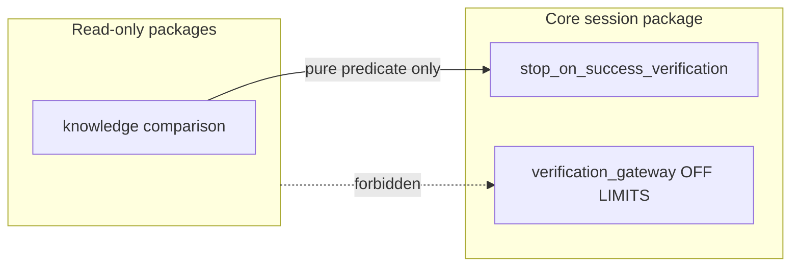
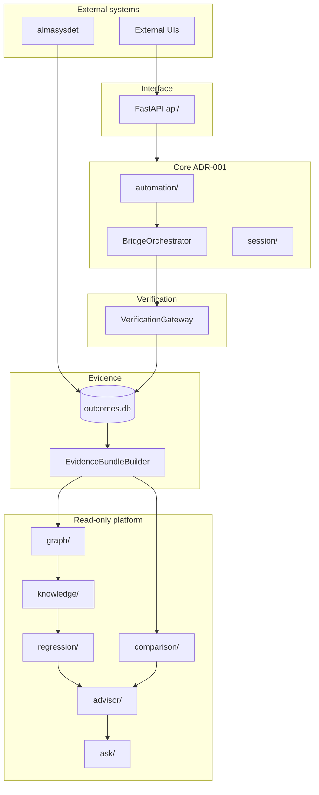
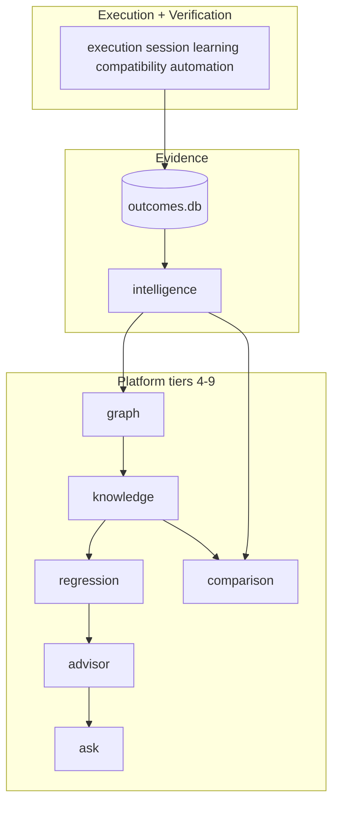
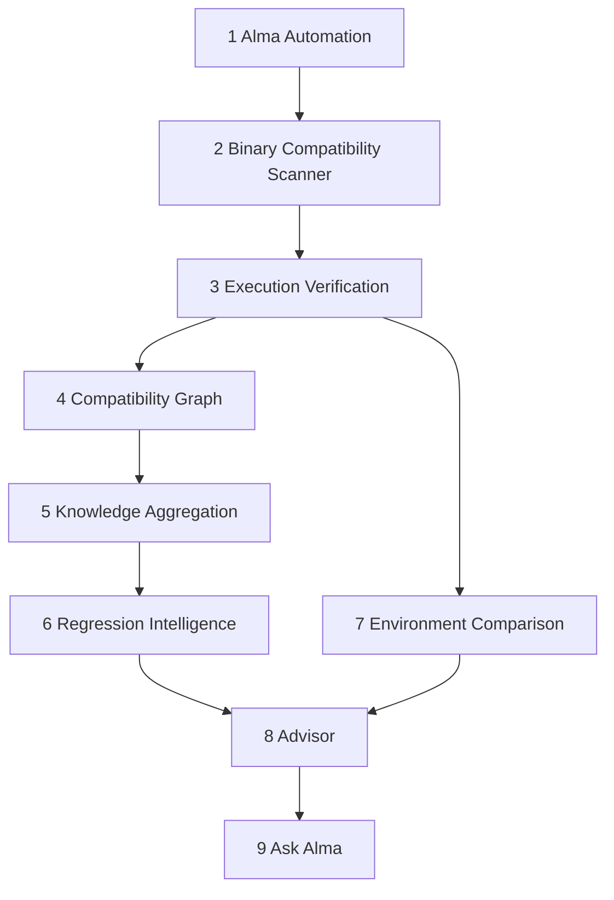
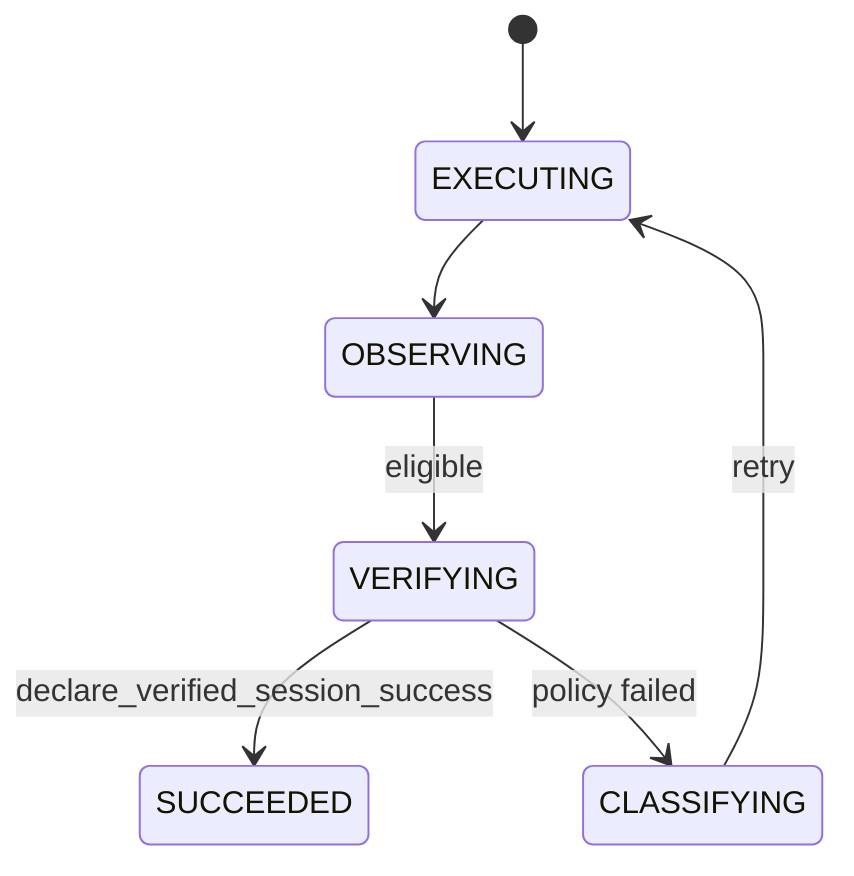
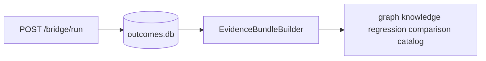
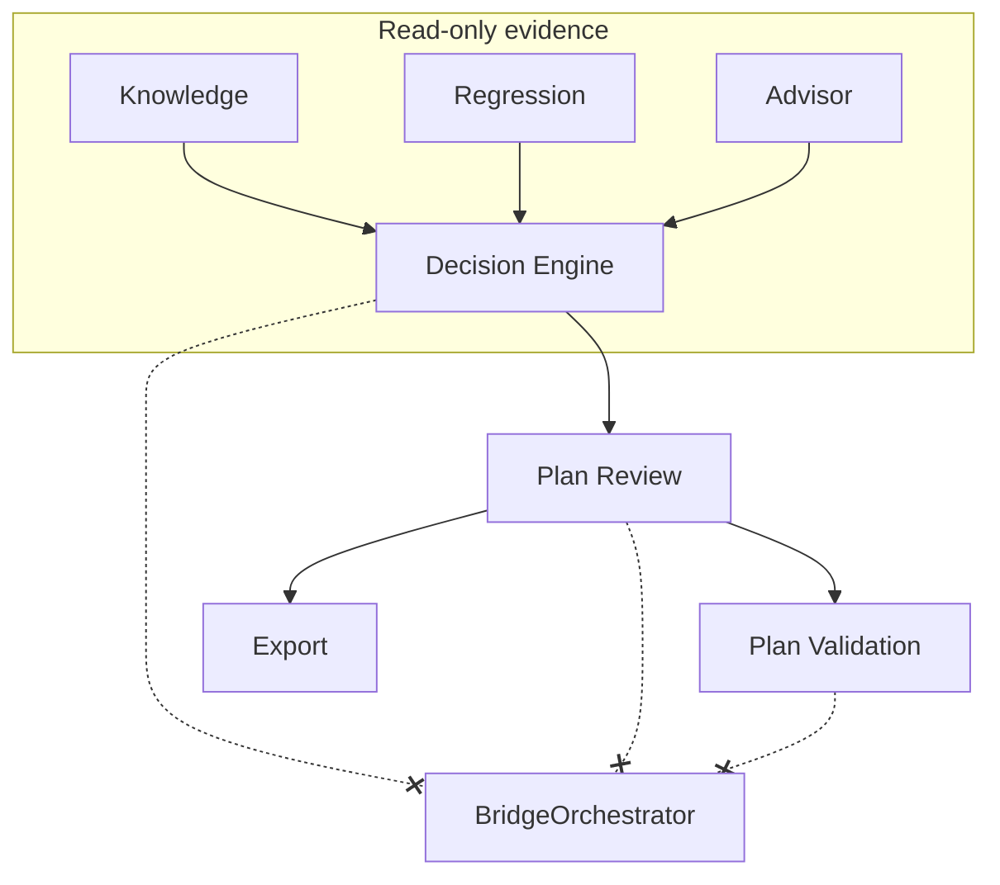
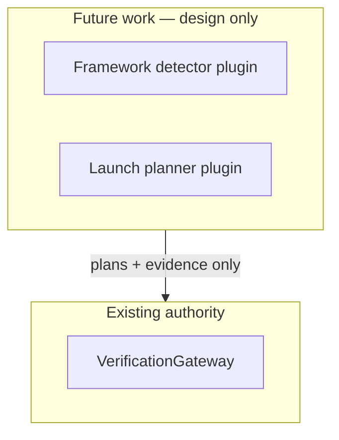

# Alma Bridge: Technical Architecture White Paper

**Document status:** As-built systems description  
**Audit baseline:** Phase 1 Architecture Audit (2026-07-31); Decision Pipeline Phases 1–3 (2026-08-02)  
**Repository:** `alma-bridge` (`alma_bridge/` package)  
**Evidence basis:** Implemented code, architecture tests, twelve accepted ADRs, Phase 1 audit documents

---

## 1. Executive Summary

Alma Bridge is a **deterministic compatibility operating system** for Linux delivered as a single FastAPI application (`alma_bridge/main.py`). Its core function is to answer, with inspectable evidence: *what must be true about this host for this Windows application to run correctly?* Alma v2.0 unifies previously isolated subsystems into one continuous evidence pipeline — static analysis, prediction, execution, verification, knowledge, regression, decision, governance, and expansion planning — bound together by immutable `CompatibilityEvidenceBundle` artifacts and lifecycle timeline events. The system inspects binaries, plans execution strategies, runs programs under guarded lifecycle authority, verifies outcomes through a structured verification engine, and persists durable evidence in SQLite. Downstream read-only layers consume that evidence to build compatibility graphs, aggregated knowledge, regression reports, session comparisons, deterministic explanations, evidence-grounded question answering, and—since August 2026—a **human-governed Decision Pipeline** that produces auditable plan recommendations, reviews, and non-executing dry-run validation reports without granting execution authority.

The architecture enforces a strict separation between **execution authority** (core) and **evidence consumers** (platform). Only `BridgeOrchestrator` drives `/bridge/run` lifecycle, and only `VerificationGateway.declare_verified_session_success()` may transition a session to `SUCCEEDED` (ADR-001). Subprocess exit codes and attempt-level success flags alone are not treated as verified compatibility success. The Decision Pipeline (ADR-010 through ADR-012) adds a third tier: **governance without execution**—operators may approve and validate plans, but no decision endpoint launches applications or mutates prefixes.

The Phase 1 audit (2026-07-31) found **no critical read-only boundary violations**. Production-readiness risks concentrate in the core cluster: scattered SQLite persistence (~20 ad-hoc schemas), mutual import cycles, and a monolithic core API router—not in platform-tier breaches of execution authority.

This repository provides HTTP JSON APIs and a CLI; the **Compatibility Explorer UI** lives in the external **almasysdet** repository and consumes Bridge decision, review, and validation endpoints via HTTP proxy.

---

## 2. Problem Statement

Running legacy Windows software on Linux hosts—particularly in constrained K-12 lab environments—requires coordinating binary format detection, Wine/Proton/container execution, prefix mutation, hardware shims, failure classification, and remediation retries. Without a single authoritative lifecycle, subsystems historically inferred success from proxy signals: exit codes, detached GUI processes, installer log completion, or prior-success lookups. That produced fragmented authority, weak session lineage, and false-positive compatibility outcomes (ADR-001 context).

The ADR-001 migration notes enumerate concrete failure modes that motivated the current design:

1. Session persistence (`success=1`) decoupled from lifecycle state, allowing database flags to disagree with verification outcomes.
2. Route services could construct `BridgeOrchestrator`, creating multiple lifecycle entry points.
3. Escalation spawned orphan child sessions instead of preserving lineage on a single `session_id`.
4. Inline application-specific success checks bypassed typed verification evidence.
5. Prior-success lookups could inform planning but were sometimes treated as authorization for current success.

Operators additionally need to understand cross-session compatibility evidence—framework observations, strategy success rates, environment changes, and regressions—without granting those analytical surfaces the ability to launch processes or mutate prefixes. A failure in this separation would allow an explanation or Q&A endpoint to reorder strategies, mutate Wine prefixes, or declare success—violating the core/platform boundary documented in `alma-bridge-platform-direction.md`.

Alma Bridge addresses both problems: a closed execution loop with verification-gated success, and a downstream read-only intelligence stack built on persisted evidence. The Phase 1 audit verified that eight read-only packages honor this separation in source imports, with executable tests as the enforcement mechanism—not prose alone.

### 2.1 External system boundaries

External Alma projects contribute complementary capabilities; they are not subsumed into the alma-bridge repository:

| Project | Role | Bridge integration |
|---------|------|-------------------|
| **almasysdet** | Binary scanning, static compatibility rules, execution history in `alma.db` | `POST /import/sysdet`, default path `../almasysdet/data/alma.db` |
| **alma_resolve** | Wine/Proton launcher recovery scripts and audit trails | `POST /import/resolve`, default audit dir `../alma_resolve/runtime_data/audit` |
| **External UIs** | Flagship console, scanner UI | HTTP clients to Bridge API; proxy references in README |

Bridge-local inspection (`GET /bridge/inspect`) provides deterministic compatibility inspection without requiring almasysdet at runtime. Historical correlation still benefits from sysdet import for training data and operator visibility.

---

## 3. Design Goals

Design goals stated in platform direction and ADRs, mapped to as-built enforcement:

| Goal | Implementation evidence |
|------|-------------------------|
| Deterministic execution planning | Versioned engines; planner in `compatibility/planner.py`; ranker optional at plan time |
| Verification before success | ADR-001; `VerificationGateway`; aggregate policy `bridge_aggregate_v1` |
| Evidence over memory for platform tier | `EvidenceBundleBuilder`; read-only packages never call orchestrator |
| Provenance on every platform claim | `EvidenceReference`, `KnowledgeEvidenceReference`, `GraphProvenance` |
| Read-only intelligence | Forbidden import tests in eleven platform packages (incl. decision pipeline) |
| Observation separated from execution | Platform reads `verification_json`; never invokes `VerificationEngine` |
| Safe host modernization path | Automation approval tokens; `allow_mutations` gates; autopilot dry-run default |
| Test-enforced architecture | 116+ test files; boundary tests per read-only package |

Goals explicitly **not** claimed as fully realized: unified persistence layer, plugin registry, in-repo Explorer UI, cloud sync—all documented as gaps or future work.

### 3.1 Configuration surface

Settings load from environment with prefix `ALMA_BRIDGE_` (`config.py`). Deployment-relevant defaults:

| Variable | Default | Implication |
|----------|---------|-------------|
| `API_HOST` | `127.0.0.1` | Localhost-first bind |
| `API_PORT` | `9010` | Standard Bridge API port |
| `DB_PATH` | `data/outcomes.db` | Authoritative evidence location |
| `MAX_ATTEMPTS` | `8` | Orchestrator retry ceiling |
| `EXECUTION_TIMEOUT_SEC` | `120` | Per-attempt timeout |
| `SANDBOX_ENABLED` | `true` | Container execution allowed |
| `API_KEY` | unset | Mutating endpoints open without auth |
| `COMPATIBILITY_PROFILE_REUSE_ENABLED` | `false` | Shadow profiles do not drive execution |

Compliance and automation variables documented in `README.md` include `COMPLIANCE_MAX_WORKERS`, `COMPLIANCE_CACHE_TTL`, `AUTOMATION_WEBHOOK_URLS`, and data retention via `COMPLIANCE_DATA_RETENTION_DAYS` (`SECURITY.md`).

### 3.2 Platform direction alignment

The nine permanent capabilities in `alma-bridge-platform-direction.md` map to as-built modules:

| Capability | Primary modules | Platform tier? |
|------------|-----------------|:--------------:|
| Application Discovery | `bridge/profile_builder.py` | Core inspect |
| Classification | `compatibility/program_kind.py` | Core |
| Dependency Resolution | `framework_detection.py` (partial); proposed engine **Future work** | Core |
| Environment Construction | `execution/preflight.py`, `session/mutations.py` | Core |
| Execution Planning | `compatibility/planner.py` | Core |
| Verified Execution | `learning/orchestrator.py`, verification services | Core |
| Evidence Collection | `storage/outcomes.py`, manifest capture | Core write |
| Knowledge Management | `knowledge/`, `graph/`, profiles | Platform read |
| Operator Experience | Platform APIs, CLI, external UIs | Platform + external |

The test for new work from platform direction: *Does it strengthen a permanent capability, or add a one-off feature?* Features may ship as expedients; capabilities are the convergence target.

---

## 4. System Requirements

### 4.1 Functional requirements (implemented)

1. **Inspect** Windows/Linux binaries and emit structured compatibility inspection (`GET /bridge/inspect`, `bridge/profile_builder.py`).
2. **Preflight** program, installer, and launcher readiness without execution (`GET /bridge/program|installer|launcher/preflight`, `execution/*_preflight.py`).
3. **Plan** execution strategies without running (`POST /bridge/plan`; planner + optional ML ranker).
4. **Execute** adaptive retry loops with remediation (`POST /bridge/run`, `BridgeOrchestrator`; max attempts from `BridgeRequest` and `settings.max_attempts`).
5. **Verify** success through structured verification, not exit code alone (ADR-001); persist `verification_json` on attempts.
6. **Persist** sessions and attempts with inspection, policy context, escalation metadata, run environment (ADR-008).
7. **Import** legacy almasysdet and alma_resolve history with dedupe via `import_log` (`importers/`).
8. **Modernize** hosts via compliance probes, TLS bridges, autopilot pathways, and automation playbooks (`compliance/`, `automation/`).
9. **Operate** optional autonomous operator loop when `operator_enabled` in lifespan (`operator/`).
10. **Run container shim packs** for sandbox-isolated legacy execution (`POST /container/run`, `execution/shim_pack.py`).
11. **Query** read-only compatibility intelligence, graph, knowledge, regression, comparison, advisor, ask, catalog (eight sub-routers in `api/`).
12. **Export** training datasets and train strategy ranker (`POST /datasets/export`, `POST /train/ranker`).
13. **Validate** shadow profile campaigns via CLI (`cli/shadow_validation.py`) and gate endpoints.

### 4.1.1 Platform tier functional requirements

Each read-only layer satisfies a distinct analytical requirement (ADRs 002–009):

| Layer | Requirement | Failure mode prevented |
|-------|-------------|------------------------|
| Intelligence | Label facts vs hypotheses from evidence | Treating shadow predictions as verified success |
| Graph | Traverse provenance-backed relationships | Ad hoc hash-only correlation for every query |
| Knowledge | Aggregate cross-session observations | Collapsing conflicting framework detections |
| Regression | Compare baseline vs current profiles | Re-executing binaries to detect regressions |
| Comparison | Diff two specific sessions | Inferring causality from environment correlation |
| Advisor | Explain with policy-checked language | Prescriptive remediation from unverified stderr |
| Ask | Answer scoped questions with citations | Open-ended LLM agent with execution side effects |
| Catalog | Browse all known application fingerprints | Manual session ID hunting |

### 4.3 Deployment topology (documented)

K-12 lab deployment documented in `README.md` and `SECURITY.md`:

- Bridge API on `127.0.0.1:9010`; external flagship console referenced at `:9002` / `:3001` (not in this repo)
- Alma Scanner UI (`almasysdet`) proxied via `/bridge-api` when co-deployed
- Data remains on district-controlled infrastructure under `data/` SQLite files
- Flagship program recipes: `school-lab` (Linux), `school-lab-windows` with PowerShell export endpoint
- Docker compose stack available for API + sandbox image (`docker compose up`)

No multi-tenant cloud control plane is implemented in this repository—**Future work** per platform direction cloud sync section.

### 4.4 Out of scope for this repository

- Frontend Compatibility Explorer (external HTTP UIs only)
- Embedded almasysdet scanner runtime (import + local inspect only)
- Plugin loading (design-only, Phase 8)
- SOC 2 certification (SECURITY.md: not yet)

### 4.5 Non-functional requirements

| Requirement | As-built status |
|-------------|-----------------|
| Localhost-first deployment | Default bind `127.0.0.1:9010` (`config.py`) |
| Optional API key on mutations | `ApiKeyMiddleware` when `ALMA_BRIDGE_API_KEY` set |
| Deterministic platform assessments | No ML/randomness in intelligence/regression/advisor Phase 1 paths (ADRs 002–006) |
| Architecture test enforcement | Boundary tests fail build on forbidden imports |
| SQLite durability | Multiple stores; no unified abstraction (limitation R1) |

---

## 5. Architectural Principles

### 5.1 Deterministic execution

The orchestrator and planner produce structured plans from inspection, hardware profile, and historical ranking. Platform assessment engines use fixed rule sets (`compatibility_intelligence_v1`, deterministic diff engines) with stable sort orders. ML ranker (`HistGradientBoostingClassifier`) scores candidate strategies during planning/ranking; it does not override verification authority or platform assessments (ADR-002 §6).

### 5.2 Verification authority

Terminal compatibility success flows through exactly one path: orchestrator enters `VERIFYING` → `DefaultVerificationEngine` returns `VerificationResult` → aggregate policy passes → result persisted → `VerificationGateway.declare_verified_session_success()`. Documented prohibited patterns include `finalize_session(success=True)` outside the gateway and prior-success bypass (ADR-001).

### 5.3 Provenance

Evidence references carry `source_type`, `source_id`, artifact keys, and capture timestamps. Graph edges require `GraphProvenance`. Knowledge fields map to `evidence_by_field`. Advisor and Ask answers cite upstream references. Insufficient evidence yields explicit limitations, not inferred facts (ADR-002, ADR-007).

### 5.4 Evidence-first platform

All platform layers begin from persisted artifacts in `outcomes.db` (and supplemental profile/shadow stores read through adapters). Nothing in the platform tier re-executes binaries to "refresh" evidence during GET handlers (framework re-detection in `EvidenceBundleBuilder` is a documented debt TD3, not live subprocess detection).

### 5.5 Read-only intelligence

Eight packages—`intelligence`, `graph`, `knowledge`, `regression`, `comparison`, `advisor`, `ask`, `catalog`—must not import orchestrator, verification gateway, prefix mutations, winetricks, or emit `ActionIntent`. Tests enforce this (`READ_ONLY_BOUNDARIES.md`).

### 5.6 Observation vs execution separation

| Execution (core) | Observation (platform) |
|------------------|------------------------|
| Launch Wine/Proton/container | Read attempt records |
| Mutate prefix via PolicyGate | Read verification JSON |
| Declare SUCCEEDED | Label verified success via predicate |
| Capture run environment on first attempt | Diff environments across sessions |
| Retry with remediation | Report regression findings (no fixes) |

### 5.7 Dependency boundary diagram



Platform tier must not import `verification_gateway`, `orchestrator`, or `session.mutations`. Enforced by eight boundary test modules. Full diagram: [diagrams/dependency_boundaries.mmd](./diagrams/dependency_boundaries.mmd).

---

## 6. Overall System Architecture

Alma Bridge runs as one ASGI process (`create_app()` in `main.py`), aggregating a monolithic core router and eight read-only sub-routers (`api/routes.py`). Persistence is primarily SQLite; configuration uses `pydantic-settings` with `ALMA_BRIDGE_` prefix.

### 6.0 Runtime shape

| Property | Value | Source |
|----------|-------|--------|
| Default bind | `127.0.0.1:9010` | `config.py` |
| Process model | Single uvicorn worker ASGI app | `main.py` |
| Background tasks | Optional `operator_loop` in lifespan; TLS modernizer bridges | `operator/`, `compliance/bridge.py` |
| Primary evidence DB | `data/outcomes.db` | `storage/outcomes.py` |
| Config prefix | `ALMA_BRIDGE_` | `config.py` |
| Test count | 116 `test_*.py` files | `ARCHITECTURE_REPORT` |

**Router aggregation** (from `api/routes.py`):

```
intelligence_router  → api/intelligence_routes.py
graph_router         → api/graph_routes.py
knowledge_router     → api/knowledge_routes.py
regression_router    → api/regression_routes.py
advisor_router       → api/advisor_routes.py
ask_router           → api/ask_routes.py
catalog_router       → api/catalog_routes.py
comparison_router    → api/comparison_routes.py
```

Core mutating routes remain in the monolithic `routes.py` (~1,255 lines)—split planned Phase 2 (`V1.2_WORK_PLAN.md`).

### 6.1 Subsystem overview

| Subsystem | Purpose | Authority | Mutability |
|-----------|---------|-----------|------------|
| Core (`execution`, `session`, `learning`, `compatibility`, `automation`, …) | Run and verify programs | Execution + verification | Writes outcomes, prefixes |
| Evidence (`storage`, `intelligence`) | Persist and assemble bundles | Write on core path; read-only rightward | `outcomes.db` writes |
| Platform (`graph` → `ask`, `catalog`) | Analyze evidence | Read-only | Graph tables on ingestion only |
| Interface (`api`, `cli`) | HTTP/CLI | Delegates | Depends on handler |

Full table: [tables/subsystems.md](./tables/subsystems.md).

### 6.2 Architecture diagram



Source: [diagrams/overall_architecture.mmd](./diagrams/overall_architecture.mmd).

### 6.3 Layer diagram



Source: [diagrams/layer_diagram.mmd](./diagrams/layer_diagram.mmd), [LAYER_DIAGRAM.md](../architecture/LAYER_DIAGRAM.md).

### 6.4 Core cluster packages (execution authority)

The core cluster contains eleven mutual import cycles per Phase 1 import graph analysis—resolved via function-local imports (`ARCHITECTURE_REPORT` R2). The following packages hold execution authority:

**`learning/orchestrator.py` — BridgeOrchestrator:** Sole owner of `/bridge/run` lifecycle. Coordinates planner, execution runner, remediation catalog, verification gateway injection, session lease, and outcome persistence. Async variant via `POST /bridge/run/async` with result polling.

**`compatibility/` — Planning and profiles:** 36 modules including `program_kind.py`, `framework_detection.py`, `planner.py`, profile store, shadow validation subsystem (`profile_shadow_*.py`). Shadow mode predicts compatibility outcomes but does not apply predictions to execution when reuse is disabled (`ALMA_BRIDGE_COMPATIBILITY_PROFILE_REUSE_ENABLED=false` per platform direction).

**`execution/` — Launch and preflight:** 18 modules for Wine/Electron/container launch, privilege elevation, shim packs, installer/launcher/program preflight endpoints. Integrates Proton discovery and alma_resolve remediation profiles on failure (`README.md`).

**`session/` — Lifecycle, policy, mutations:** State machine (`lifecycle.py`), `PolicyGate`, `VerificationGateway`, prefix lock, lease manager, verification services. Central enforcement point for ADR-001.

**`compliance/` — Host modernization:** TLS assessment and modernizing bridges, DNS-over-HTTPS, driver inventory, web3 probes, autopilot diagnose/plan/feedback, legacy 32-bit assessor, modernization playbooks for Linux and Windows export. Lifecycle separate from bridge verification (ADR-001 migration notes).

**`automation/` — Operator pipeline:** Unified spine connecting compliance assessment, playbook apply, post-apply verify, optional bridge run, autopilot learning. Approval tokens gate mutating apply steps.

**`operator/` — Optional autonomy:** Background loop when enabled; tick/remediate endpoints for observe→decide→apply without replacing ADR-001 bridge lifecycle.

**`validation/` — Campaign guardrails:** `campaign_guard.py` rejects bridge runs for configured campaign prefixes; freeze and semantic validators support shadow validation campaigns.

### 6.5 Persistent data model (authoritative session schema)

Key columns on `bridge_sessions` (`storage/outcomes.py`, `DATA_FLOW.md` §2):

| Column group | Fields | Purpose |
|--------------|--------|---------|
| Identity | `session_id`, `file_path`, `file_hash` | Session and application fingerprint |
| Timing | `started_at`, `finished_at`, `session_timeout_at` | Ordering and lease timeout |
| Outcome | `success`, `summary`, `session_state` | Coarse outcome—`success` only trustworthy after gateway |
| Inspection | `inspection_json` | Captured compatibility inspection |
| Policy | `policy_context_json`, `escalation_json` | Mutation and escalation audit |
| Environment | `run_environment_json` | Immutable capture on first attempt (ADR-008) |
| Lineage | `parent_session_id`, `correlation_id` | Session relationships |
| Lease | `lease_owner_id`, `lease_expires_at` | Concurrent worker guard |

Key columns on `bridge_attempts`:

| Column group | Fields | Purpose |
|--------------|--------|---------|
| Strategy | `strategy_id`, `runtime`, `phase`, `route_id` | Execution path |
| Outcome | `success`, `exit_code`, `error_signature` | Proxy signals—not verification |
| Evidence | `verification_json`, `stdout`, `stderr` | Structured verification + logs |
| Policy | `policy_decision_json`, `escalation_kind` | Gate audit trail |

Online column migrations applied via `_SESSION_COLUMN_MIGRATIONS` and `_ATTEMPT_COLUMN_MIGRATIONS` in `outcomes.py`.

### 6.6 API surface summary

Representative endpoint counts by tier:

| Tier | Methods | Side-effect profile |
|------|---------|---------------------|
| Platform read-only | 15+ GET (+ Ask POST) | No execution; graph ingestion writes graph tables only |
| Bridge inspect/plan | GET + POST plan | No launch |
| Bridge run | POST | Full execution authority |
| Compliance | Mixed GET/POST | Probes vs TLS bridge vs autopilot execute |
| Automation | POST run/approve | Host mutation when apply=true |

Full endpoint table: [tables/api_endpoints.md](./tables/api_endpoints.md).

---

## 7. Execution Pipeline

The operator-facing vertical chain maps to concrete modules. Stages 1–3 are core authority; stages 4–9 are read-only platform (with EvidenceBundleBuilder as the shared substrate after persistence).



Source: [diagrams/execution_pipeline.mmd](./diagrams/execution_pipeline.mmd). Deep-dive: [architecture/execution_pipeline.md](./architecture/execution_pipeline.md).

### 7.1 Alma Automation

**Modules:** `alma_bridge/automation/runner.py`, `playbooks.py`, `scanlite.py`, `verify.py`, `approval.py`, `sessions.py`.

**Purpose:** Unified host modernization pipeline documented as `scan → assess → playbook → apply → verify → bridge → autopilot → learn`.

**Inputs:** Playbook recipe ID, optional scan path, approval token, `apply` flag, optional `file_path` for bridge run.

**Outputs:** Automation audit session with phase timeline; optional bridge session if `bridge_run=true`; webhook events if configured.

**Authority:** Mutates host when `apply=true` and gating passes (`allow_mutations` or approval token). Default is plan-only.

**API:** `POST /automation/run`, `GET /automation/health`, fleet agent endpoints (`README.md` automation table).

**Relationship to bridge lifecycle:** Automation may optionally invoke `BridgeOrchestrator` when `bridge_run=true`, but automation's own audit trail lives in automation session tables separate from `bridge_sessions`. Host modernization verify step (`automation/verify.py`) re-assesses compliance posture; it is not ADR-001 session verification unless a bridge run is included.

**Built-in playbook recipes** (from README): `school-lab`, `container-lab`, `potato-browser-only`, `full-legacy-x86`, `connectivity-only`. Recipes declare step IDs requiring approval tokens when mutating.

### 7.2 Binary Compatibility Scanner

**External component:** **almasysdet** — binary scanning, static rules, `alma.db` history (`README.md`).

**In-repo components:**
- `GET /bridge/inspect` → `build_compatibility_inspection()` (`bridge/profile_builder.py`)
- `importers/sysdet.py` → `POST /import/sysdet` writes historical sessions into `outcomes.db`
- `execution/runner.file_hash` for content fingerprint
- `compatibility/program_kind.py`, `framework_detection.py` for classification

**Inputs:** File path; external DB path for import.

**Outputs:** `CompatibilityInspection`; imported session/attempt rows.

**Note:** The full scanner is **not** embedded in alma-bridge; Bridge performs local inspection and ingests external scan history.

**Import mapping:** `importers/mappings.py` translates sysdet runtime identifiers to Bridge strategy IDs and normalizes error signatures. Imported sessions preserve source keys in `import_log` for idempotent re-import when `skip_existing=true`.

**Import pipeline behavior** (`importers/service.py`):

1. `POST /import/all` invokes sysdet then resolve importers sequentially
2. Each row maps to `outcomes.import_session()` with hardware profile snapshot at import time
3. Duplicate detection via `import_log` source keys (`sysdet:{id}`, resolve audit paths)
4. Errors collected per-row without aborting entire batch

Default paths configurable: `ALMA_BRIDGE_SYSDET_DB_PATH`, `ALMA_BRIDGE_RESOLVE_AUDIT_DIR` (`README.md`).

**Classification routing:** `compatibility/program_kind.py` determines program kind (installer, GUI, Electron, console, etc.) influencing orchestrator routing in `learning/orchestrator.py`. Framework detection (`framework_detection.py`) supports wxWidgets heuristics today; platform direction notes proposed generalized dependency resolution as roadmap work.

**Inspection output:** `CompatibilityInspection` schema (`schemas/bridge_domain.py`) captures binary metadata consumed by planner and persisted in `inspection_json` on sessions—available to platform tier via evidence bundles without re-reading binaries.

### 7.3 Execution Verification

**Modules:** `learning/orchestrator.py` (lifecycle driver), `execution/runner.py` (launch), `session/services/verification.py` (engine), `session/verification_gateway.py` (sole success path), `session/stop_on_success_verification.py` (aggregate predicate).

**Inputs:** `BridgeRequest`, hardware profile, strategies, execution evidence.

**Outputs:** Persisted attempts with `verification_json`; session `success` only after gateway declaration; `run_environment_json` captured on first attempt (ADR-008).

**Chain:** `POST /bridge/run` → campaign guard → `BridgeOrchestrator.run()` → execute → `VerificationGateway.run()` → `declare_verified_session_success()` → `outcomes.db`.

**Orchestrator responsibilities** beyond launch (`learning/orchestrator.py`):

- Acquire and renew session lease (`session/lease.py`)
- Invoke `DefaultCompatibilityPlanner` for strategy selection
- Apply remediations from catalog and hardware shims on failure
- Transition lifecycle states via `SessionLifecycleManager`
- Enter verification through injected gateway—not inline success checks

**Execution backends** (`execution/runner.py`): native, Wine, Proton, Electron handoff, container sandbox. Container path uses shim catalog from `hardware/shims.py` and optional Docker/Podman image (`settings.sandbox_image`).

**Verification phases:** `DefaultVerificationEngine` routes to installer, launcher, or process verifiers. Aggregate policy `bridge_aggregate_v1` defines required checks per phase. Verifier exceptions become structured failure evidence; they never produce `SUCCEEDED` (ADR-001).

**Escalation:** Preserves same `session_id`; metadata on parent session; successful escalation retries still pass through `VERIFYING`—no orphan child bridge sessions.

Illustrative gateway responsibility:

```python
# alma_bridge/session/verification_gateway.py
# VerificationGateway — runs OBSERVING → VERIFYING, invokes verifier,
# declare_verified_session_success() is sole SUCCEEDED path (ADR-001)
```

**Prefix mutation path:** All mutations expressed as `ActionIntent`; `PolicyGate.evaluate()` must approve; `run_prefix_mutation()` enforces policy then `fcntl.flock` lock files under `{data_dir}/locks/` (lock files never deleted—kernel ownership authoritative per ADR-001).

### 7.4 Compatibility Graph

**Modules:** `graph/ingestion.py`, `graph/service.py`, `graph/repository.py`.

**Inputs:** `EvidenceBundle` via read-only adapters.

**Outputs:** `GraphNode`, `GraphEdge`, `GraphSubgraph` with mandatory provenance.

**Authority:** Non-authoritative (ADR-003). Lazy idempotent ingestion on GET; never consumed by planner. `verified_by` edges only when `verification.passed is True`.

**API:** `GET /bridge/graph/applications/{fingerprint}`, `/sessions/{session_id}`, `/nodes/{id}`, `/edges/{id}`.

### 7.5 Knowledge Aggregation

**Modules:** `knowledge/aggregation.py`, `knowledge/service.py`.

**Inputs:** `EvidenceBundle` for all sessions sharing `file_hash`.

**Outputs:** `CompatibilityKnowledgeProfile` — framework classifications (`observed`, `repeated`, `conflicting`), strategy success rates, observed environments, conflicts preserved.

**Authority:** Non-authoritative (ADR-004). Success counts use `aggregate_verification_passed` only. Computed on read; no Phase 1 KB tables.

**API:** `GET /bridge/knowledge/applications/{fingerprint}`.

### 7.5.1 Compatibility profile and shadow subsystem (core)

The `compatibility/` package (36 modules) includes profile creation, manifest capture, shadow prediction, and validation campaign infrastructure—distinct from the read-only `knowledge/` aggregation layer:

| Component | Role | Authority |
|-----------|------|-----------|
| `profile_store.py` | Persist compatibility profiles and candidates | Core write |
| `profile_shadow.py` | Shadow predictions before planning | Non-authoritative when reuse disabled |
| `profile_manifest_capture.py` | Capture prefix manifest snapshots | Evidence for graph/knowledge |
| `profile_shadow_validation_*.py` | Campaign labels, gates, export | Validation only—not execution |

Shadow comparison metrics appear in evidence bundles as inputs to hypotheses (ADR-002). Shadow validation CLI (`cli/shadow_validation.py`) and HTTP gate endpoints support operator review before any profile promotion.

**Future work:** Converging `CompatibilityBridgePlan` schema with orchestrator planner input (TD6). General dependency resolution engine (platform direction Priority 1).

### 7.6 Regression Intelligence

**Modules:** `regression/diff.py`, `regression/service.py`, `regression/queries.py`.

**Inputs:** Knowledge profiles: baseline (excluding comparison session X) vs current (all sessions).

**Outputs:** `CompatibilityRegressionReport` with typed findings (`VERIFIED_SUCCESS_TO_VERIFIED_FAILURE`, `FRAMEWORK_CHANGED`, `ENVIRONMENT_CHANGED`, etc.).

**Authority:** Pure diff; no recommendations (ADR-005).

**API:** `GET /bridge/regression/applications/{fingerprint}`, `/sessions/{session_id}`.

### 7.7 Environment Comparison (Session Comparison)

**Modules:** `comparison/diff.py`, `comparison/service.py`, `comparison/queries.py`.

**Inputs:** Two session IDs with matching `file_hash`; session evidence snapshots.

**Outputs:** `SessionEnvironmentComparison` with field-level diffs and evidence refs; non-causality notice when environment and verification both change (ADR-009).

**Distinction from regression:** Session-scoped pair compare vs application-level aggregate baseline compare.

**API:** `GET /bridge/comparison/sessions/{baseline}/{comparison}`, `/applications/{fingerprint}`.

### 7.8 Advisor

**Modules:** `advisor/explanation.py`, `advisor/context.py`, `advisor/service.py`, optional `advisor/llm/`.

**Inputs:** Knowledge + regression context (graph service not invoked on GET in Phase 1 per ADR-006).

**Outputs:** `AdvisorExplanation` with policy-validated deterministic copy; optional LLM render when configured.

**Authority:** Read-only; forbidden prescriptive phrases in `advisor/policy.py` (ADR-006).

**API:** `GET /bridge/advisor/applications/{fingerprint}`, `/sessions/{session_id}`.

### 7.9 Ask Alma

**Modules:** `ask/classifier.py`, `ask/context.py`, `ask/answer.py`, `ask/service.py`.

**Inputs:** `AskAlmaQuestion` (natural language, fingerprint, optional session_id).

**Outputs:** `AskAlmaAnswer` with evidence references; `UNSUPPORTED` class yields limitation message.

**Authority:** Read-only POST (no persistence) (ADR-007). Deterministic classification first; optional LLM wording only.

**API:** `POST /bridge/ask`.

---

## 8. Verification Authority

Verification authority is the central architectural law of Alma Bridge (ADR-001). The Phase 1 audit grades boundary integrity A- with two documented predicate-import smells, not violations (`ARCHITECTURE_REPORT` §6).

### 8.1 Authority table

| Component | Role |
|-----------|------|
| `BridgeOrchestrator` | Sole lifecycle owner for `/bridge/run` |
| `SessionLifecycleManager` | State machine with optimistic concurrency |
| `DefaultVerificationEngine` | Phase-aware verifiers; aggregate policy |
| `VerificationGateway` | Sole `SUCCEEDED` and `finalize_session(success=True)` |
| `PolicyGate` | Approves `ActionIntent` before mutations |
| `SessionLeaseManager` | DB-backed lease for concurrent workers |
| `prefix_lock` | Filesystem lock for prefix serialization |

### 8.2 Lifecycle diagram



Source: [diagrams/verification_authority.mmd](./diagrams/verification_authority.mmd).

### 8.3 Aggregate policy

`aggregate_verification_passed()` in `session/stop_on_success_verification.py` evaluates persisted verification JSON. Platform layers import this pure function so read-path metrics match write-path authority—a layering smell documented for Phase 3 relocation to a neutral module.

### 8.4 Prohibited patterns (ADR-001)

The following remain architecturally prohibited; tests and code review target their absence:

1. `finalize_session(success=True)` outside `VerificationGateway`
2. Direct `SUCCEEDED` transitions outside verified-success path
3. Child bridge sessions for internal escalation
4. Recursive `BridgeOrchestrator` construction in route executors
5. Unguarded prefix mutation (without PolicyGate + prefix_lock)
6. Route-level success treated as session-level success
7. Prior-success lookup bypassing current verification
8. Inline success decisions in orchestrator execution paths

### 8.5 PrefixReadinessProfile boundary

ADR-001 migration notes: `PrefixReadinessProfile` is a prefix readiness cache only—it is **not** a compatibility profile and does not authorize success. Future `CompatibilityProfile` reuse must bind to `VerificationBinding` and still re-verify on reuse.

### 8.6 Tests

- `tests/test_verification_authority.py`
- `tests/test_orchestrator_authority.py`
- `tests/test_architecture_invariants.py`

Deep-dive: [architecture/verification_authority.md](./architecture/verification_authority.md).

---

## 9. Evidence Model

### 9.1 Canonical store

`storage/outcomes.py` manages `data/outcomes.db`:

- **`bridge_sessions`** — session metadata, inspection, policy context, run environment, lifecycle fields.
- **`bridge_attempts`** — per-try records including `verification_json`, strategies, signatures.

Application identity for platform queries is currently `file_hash` equality—a Phase 1 limitation (R8).

### 9.2 EvidenceBundleBuilder

`intelligence/evidence.py::EvidenceBundleBuilder` assembles:

- Typed `EvidenceReference` list (SESSION, ATTEMPT, VERIFICATION, INSPECTION, RUN_ENVIRONMENT, …)
- Artifact map keyed by convention (`attempt:{sid}:{n}`, etc.)
- Explicit `limitations` for incomplete legacy data

```python
# alma_bridge/intelligence/evidence.py
class EvidenceBundleBuilder:
    """Assemble versioned evidence bundles without writes or subprocess side effects."""
```

### 9.3 Supplemental stores

Profile DB, shadow prediction/comparison stores, automation sessions, compliance healing store, graph tables—each with separate SQLite ownership (`DATA_FLOW.md` §3). **No unified persistence layer** (R1).

### 9.4 Evidence flow diagram



Source: [diagrams/evidence_flow.mmd](./diagrams/evidence_flow.mmd).

Deep-dive: [architecture/evidence_model.md](./architecture/evidence_model.md).

### 9.5 Compatibility Intelligence assessment

Before graph or knowledge reshaping, `intelligence/` performs deterministic assessment (ADR-002):

**Engine:** `CompatibilityAssessmentEngine` with `engine_version = compatibility_intelligence_v1`.

**Outputs:**
- `CompatibilityFact` — proven claims, each citing `EvidenceReference` records
- `CompatibilityHypothesis` — unresolved questions, shadow predictions, stderr heuristics—never promoted to facts without verification pass
- Confidence summaries with stable sort order

**API:**
- `GET /bridge/intelligence/sessions/{session_id}`
- `GET /bridge/intelligence/applications/{fingerprint}`

**Repository boundary:** `OutcomesStoreAdapter` implements `CompatibilityEvidenceRepository` Protocol—all SQL confined to adapter; engine receives in-memory structures only.

**Fact vs hypothesis example:**

| Claim type | Source rule |
|------------|-------------|
| `verified_successful_launch` | Winning attempt verification `passed=True` under aggregate policy |
| Shadow prediction | Hypothesis only—never proven fact |
| Framework guess from stderr | Hypothesis unless backed by persisted detection artifact |

Tests: `tests/intelligence/test_architecture_boundaries.py`.

---

## 10. Compatibility Graph

Phase 1 graph (`alma_bridge/graph/`) materializes evidence into versioned nodes and edges (`compatibility_graph_v1` schema). Identities are SHA-256 derived for idempotent re-ingestion (ADR-003).

**Edge rules (selected):**

| Edge type | Condition |
|-----------|-----------|
| `session_for_application` | Persisted session with `file_hash` |
| `detected_framework` | Framework detection artifacts |
| `launched_via` | Attempt `strategy_id` |
| `verified_by` | **Only** `verification.passed is True` |
| `session_used_environment` | Run environment capture (ADR-008) |

Graph output does not feed the planner. Ingestion occurs on graph GET (lazy). Background indexer: **Future work** (ADR-003 consequences).

**Storage:** `GraphStore` writes only to `compatibility_graph_nodes` and `compatibility_graph_edges`—never mutates `bridge_sessions` or `bridge_attempts` on read paths (ADR-003 §5).

**Node/edge identity:** SHA-256 over canonical payloads (`compatibility_graph_v1`); re-ingesting identical evidence yields identical IDs; conflicting evidence produces distinct edge IDs with different provenance fingerprints.

**Intelligence reuse:** Ingestion calls `EvidenceBundleBuilder` through `ReadOnlyGraphEvidenceAdapter`—no direct SQL in ingestion engine beyond graph store writes.

---

## 11. Knowledge Aggregation

`KnowledgeAggregationEngine` (`knowledge/aggregation.py`) produces cross-session profiles:

- Framework observations with conflict preservation
- Strategy attempt counts and verified success rates (predicate-gated)
- Observed runtimes and environments
- Per-field provenance maps

Classifications `observed`, `repeated`, `conflicting`—no `confirmed_required` (ADR-004). Does not trigger graph ingestion on read paths.

**Session ordering:** Aggregation respects session ordering by timestamps and IDs consistent with regression layer—never raw SQLite row order (ADR-005 baseline semantics align).

**Environment observations:** Post-ADR-008 sessions include `observed_environments` from `run_environment_json`. Legacy sessions omit environment fields; aggregation never fabricates values.

**Strategy metrics:** Per-strategy attempt counts and verified success rates computed only when `aggregate_verification_passed({"verification": ...})` is True—aligning dashboard numbers with ADR-001 authority.

**Provenance:** `KnowledgeEvidenceReference` per field in `evidence_by_field` maps aggregated claims back to attempt/session artifacts for Advisor and Ask citation chains.

---

## 12. Regression Intelligence

`RegressionDiffEngine.compare(before, after)` is pure—no SQL, no orchestrator (ADR-005).

**Baseline semantics:** For comparison session X, baseline aggregates all other sessions ordered by `(started_at, session_id)`. First session yields zero findings with explicit insufficient-baseline summary.

**Constants:** `MIN_BASELINE_ATTEMPTS = 3`, `MIN_RATE_DELTA = 0.25`, `SUCCESS_RATE_DROP_THRESHOLD = 0.75`.

Language distinguishes "compatibility regression" (verified success → verified failure) from factual changes that are not failures (framework evidence changed).

**Finding types** (ADR-005 §2):

| Type | Semantics |
|------|-----------|
| `VERIFIED_SUCCESS_TO_VERIFIED_FAILURE` | Compatibility regression |
| `FRAMEWORK_CHANGED` | Framework evidence changed—not labeled failure |
| `VERIFICATION_CONTRACT_CHANGED` | Verification contract changed |
| `RUNTIME_OBSERVATION_CHANGED` | Runtime observation changed |
| `NEW_CONFLICT` | New conflicting evidence |
| `STRATEGY_SUCCESS_RATE_DROPPED` | Factual rate change—not "broken" |
| `ENVIRONMENT_CHANGED` | From ADR-008/009 environment fields |

Every finding requires non-empty `previous_state.evidence_references` and `current_state.evidence_references`. Top-level references are deterministic union of before/after refs.

**Service composition:** `CompatibilityRegressionService` builds bundles via `EvidenceBundleBuilder`, profiles via `KnowledgeAggregationEngine`, diffs via pure `RegressionDiffEngine`—no graph ingestion on read paths (ADR-005 §6).

---

## 13. Session Comparison

ADR-009 adds session-pair comparison distinct from regression:

- Requires matching fingerprints; 404 on missing sessions; 422 on malformed evidence
- Missing environment fields stay null—never fabricated
- Explicit non-causality when environment and verification outcome both change
- No prescriptive remediation language

Implementation: `SessionComparisonService` + `SessionComparisonDiffEngine` (`comparison/service.py`, `comparison/diff.py`).

**Snapshot construction:** `comparison/queries.py` builds `SessionEvidenceSnapshot` from `EvidenceBundle`—environment, verification, frameworks, runtimes. Uses private bridge to `KnowledgeAggregationEngine._to_knowledge_ref` (TD4 encapsulation debt).

**Regression vs comparison:**

| Dimension | Regression (`regression/`) | Comparison (`comparison/`) |
|-----------|---------------------------|---------------------------|
| Scope | Application fingerprint aggregate | Two specific sessions |
| Baseline | All sessions except comparison session | Explicit baseline session ID |
| Primary use | Detect profile drift/regression | Side-by-side environment/outcome diff |
| Causality | Descriptive only | Explicit non-causality notice when env + verification change |

Tests: `tests/comparison/test_comparison_integration.py`, `tests/comparison/test_comparison_architecture_boundaries.py`.

---

## 14. Advisor

Phase 1 advisor contract (ADR-006):

- Template-based deterministic explanations citing knowledge/regression provenance
- `policy.py` blocks prescriptive phrases ("Use wine_gui", "Alma recommends", …)
- Optional LLM render via `OptionalLLMRenderer` when `settings.advisor_llm_enabled`; validation failure falls back to deterministic mode
- Does not invoke graph ingestion on GET; graph summary derived from knowledge profile

**Context construction:** `AdvisorContextBuilder` composes knowledge profile summaries and regression findings via `ReadOnlyRegressionEvidenceAdapter`. Session-scoped explanations resolve fingerprint from session record.

**Render modes:** `render=deterministic` (default) or `render=llm` query param. LLM path uses `OptionalLLMRenderer` with timeout from `settings.advisor_llm_timeout_seconds`. Policy validation runs on output; violations raise `PolicyViolationError`.

**Forbidden language examples** (non-exhaustive, from ADR-006): "Use wine_gui", "Best strategy", "Requires VC++", "Application is broken", "Alma recommends". Templates describe what evidence shows—not what operator should execute.

Tests: `tests/advisor/test_advisor_architecture_boundaries.py` verifies GET-only routes and no orchestrator import side effects on sample GET.

---

## 15. Ask Alma

Ask Alma (ADR-007) pipeline:

```
Question → QuestionClassifier → EvidenceQueryPlanner → context build → DeterministicAnswerBuilder → optional LLM render → policy validation
```

- Pattern-based classification; no LLM required in Phase 1
- Minimal evidence fetches per question class
- `POST /bridge/ask` creates no persistent state
- Unsupported questions return explicit limitation answers

**Question classes:** `QuestionClassifier` maps patterns to types (verification outcome, framework observations, regression summary, etc.). `QuestionType.UNSUPPORTED` yields deterministic limitation response without fetching unnecessary layers.

**EvidenceQueryPlanner:** Minimizes service calls—does not blindly fetch graph, knowledge, regression, and advisor for every question. Graph ingestion explicitly avoided on Ask paths (ADR-007 §3).

**LLM boundary:** `OptionalLLMAnswerRenderer` with `NullAskLLMProvider` by default. When `settings.advisor_llm_enabled`, LLM may rewrite wording only; cannot add observations or change verification semantics. Failure → `render_mode=deterministic_fallback`.

**Provenance requirement:** Every factual answer includes `evidence_references`. Insufficient evidence yields explicit limitation message—not general model knowledge.

Tests: `tests/ask/test_ask_architecture_boundaries.py`.

---

## 16. Decision Pipeline

The Decision Pipeline (ADR-010, ADR-011, ADR-012) extends the read-only platform tier with human-governed plan artifacts. It does **not** invoke `BridgeOrchestrator`, mutate prefixes, or consume verification authority.



### 16.1 Phase 1 — Decision Engine (`decision/`)

Deterministic `DecisionPlan` recommendations synthesizing Knowledge, Regression, optional Comparison, Advisor observations, and optional Ask Alma context. Every recommendation includes confidence, constraints, provenance, and `human_approval_required=true`.

- `GET/POST /bridge/decision/plan`
- Stable `plan_id`; no plan persistence in Phase 1
- Forbidden imports: orchestrator, runner, VerificationGateway, ActionIntent

### 16.2 Phase 2 — Plan Review (`decision_review/`)

Append-only human review workflow binding approval to canonical `plan_digest` (excludes `generated_at`). Stale approvals do not carry forward silently.

- `GET/POST /bridge/decision/plans/{plan_id}/reviews`
- `POST /bridge/decision/plans/{plan_id}/export` (JSON, Markdown)
- Eight-point approval policy including risk acknowledgement and evidence requirements
- Export disclaimer: *This artifact does not authorize or perform execution.*

### 16.3 Phase 3 — Plan Validation (`decision_validation/`)

Non-executing dry-run of approved plans against current host inventory and policy simulation.

- `POST /bridge/decision/plans/{plan_id}/validate` (`mode: dry_run` only)
- Every report: `execution_performed=false`, `mutations_performed=false`
- Status precedence: `stale` → `invalid` → `blocked` → `indeterminate` → `valid`
- `has_warnings=true` when valid with observational warnings (e.g. optional legacy env fields)

**No execute endpoint exists.** Approval and validation are operator decision records, not execution events.

Deep-dive: [architecture/decision_pipeline.md](./architecture/decision_pipeline.md).

Tests: `tests/decision/`, `tests/decision_review/`, `tests/decision_validation/` (78+ cases including status reducer matrix and architecture boundary guards).

Explorer UI (almasysdet): Decision Plan tab, Plan Review workflow, Validate plan control—no Run/Execute/Apply buttons.

---

## 17. Compatibility Catalog

`catalog/` provides a read-only application browser (ADR-008):

- `GET /bridge/catalog/applications`
- Aggregates fingerprints via `CatalogAggregationEngine` using `EvidenceBundleBuilder`
- Cross-cutting browser parallel to the vertical chain—not downstream of Ask Alma

Lists applications with summary fields drawn from knowledge/regression evidence adapters.

**Aggregation path:** For each fingerprint from `ReadOnlyCatalogEvidenceAdapter.list_application_fingerprints()`, `CatalogAggregationEngine` builds per-app summaries using `EvidenceBundleBuilder`—same evidence substrate as other platform layers (ADR-008).

**404 behavior:** Empty catalog raises `CatalogNotFoundError` → HTTP 404—distinct from empty list with partial data.

**Position in architecture:** Catalog is a top-level browser (⊕ in layer diagram), parallel to the vertical chain rather than strictly downstream of Ask Alma. It cross-cuts knowledge and regression summaries for discovery use cases.

Tests: `tests/catalog/test_catalog_architecture_boundaries.py`.

---

## 18. Architecture Decisions (ADR-001+)

| ADR | Title | Status |
|-----|-------|--------|
| ADR-001 | Authoritative bridge lifecycle and verification boundary | Accepted |
| ADR-002 | Compatibility intelligence boundary | Accepted |
| ADR-003 | Compatibility graph non-authoritative | Accepted |
| ADR-004 | Compatibility knowledge aggregation | Accepted |
| ADR-005 | Compatibility regression intelligence | Accepted |
| ADR-006 | AI advisor read-only boundary | Accepted |
| ADR-007 | Ask Alma evidence-grounded Q&A | Accepted |
| ADR-008 | Run environment and catalog | Accepted |
| ADR-009 | Environment-aware session comparison | Accepted |
| ADR-010 | Decision Engine read-only and deterministic | Accepted — 2026-08-02 |
| ADR-011 | Decision plan review, approval, and export | Accepted — 2026-08-02 |
| ADR-012 | Approved plan validation and dry-run | Accepted — 2026-08-02 |

Full decision/rationale table: [tables/adrs.md](./tables/adrs.md).

**Related design (not ADR):** Plugin architecture — design-only stub, Phase 8 ([plugin-architecture.md](../architecture/plugin-architecture.md)).

---

## 19. Security

Alma Bridge targets on-premise K-12 lab deployment (`SECURITY.md`).

**Network:** Default localhost bind; do not expose 9010/9002 publicly without controls.

**Authentication:** Optional API key gates mutating endpoints; read-only monitoring routes stay open.

**Mutation gates:** Campaign guard, automation approval tokens, modernization `allow_mutations`, PolicyGate + prefix_lock for Wine prefixes.

**Privacy:** No student PII by default; automation logs redact secrets; 365-day retention default.

**Platform defense-in-depth:** Read-only packages cannot import execution authority even if HTTP were misconfigured—boundary tests enforce imports.

**CORS:** Hardcoded dev origins (R5)—deploy-time configuration recommended.

Deep-dive: [architecture/security_model.md](./architecture/security_model.md).

### 19.1 Mutating endpoint inventory (representative)

When API key is configured, the following classes require authentication (`SECURITY.md`):

| Class | Examples |
|-------|----------|
| Bridge execution | `POST /bridge/run`, `/bridge/run/async` |
| Host apply | `POST /modernization/apply`, `/modernization/windows/apply` |
| Automation | `POST /automation/run`, `/approve`, `/agent/*` |
| Container | `POST /container/run` |
| Data import/export | `POST /import/*`, `/train/ranker`, `/datasets/export` |
| Compliance mutation | `POST /compliance/tls/bridge`, `/autopilot/run` |
| Data purge | `DELETE /compliance/program/data` |

Read-only platform GET routes (`/bridge/knowledge/*`, `/bridge/advisor/*`, etc.) and assess endpoints remain unauthenticated for monitoring UIs—network isolation remains the primary production control.

### 19.2 Autopilot safety model

Compliance autopilot (`compliance/autopilot.py`) is dry-run by default. With `execute:true`, only allow-listed read-only probes run (`ldd`, `ldconfig -p`, local `curl`, etc.). Mutating steps are returned as plans for operator review—destructive commands are not generated (`README.md` autopilot section).

---

## 20. Performance

### 19.1 Documented measurements

The compliance suite documents bounded concurrency optimizations in `README.md`:

- Shared capped thread pool for independent probes
- Measured ~**3.8×** faster than sequential on a 4-target unified scan (network-bound workloads)
- TTL cache for repeated TLS/web3/DoH probes
- Global semaphore cap on concurrent network operations (`COMPLIANCE_MAX_WORKERS`)

These figures apply to **`/compliance/scan`** and related probes—not to the core `/bridge/run` adaptive execution loop.

### 19.2 Not yet benchmarked

- End-to-end `/bridge/run` latency across strategy retries
- Verification engine overhead vs legacy exit-code paths
- Graph lazy ingestion cost at scale
- Knowledge aggregation on large session sets
- Platform API p99 under concurrent GET load

**Status:** Not yet benchmarked; no SLA claims made.

### 19.3 Resource model

- Single ASGI process; optional background `operator_loop` when enabled
- SQLite without shared connection pool—concurrent write contention possible (R1)
- Ranker model artifact: `data/models/strategy_ranker.joblib`

### 19.4 Technical debt affecting performance predictability

| ID | Issue | Performance impact |
|----|-------|---------------------|
| R1 | Scattered SQLite without shared pool | Write contention under concurrent `/bridge/run` |
| R2 | Core import cycles with deferred imports | First-request latency spikes on cold paths |
| TD3 | Duplicate framework heuristics in evidence builder | Extra CPU on large evidence bundles |
| Graph lazy ingestion | No background indexer | Graph GET latency grows with evidence volume |

These are architectural observations from the Phase 1 audit—not measured latency figures.

---

## 21. Testing

### 21.1 Scale

Phase 1 audit baseline: **116** `test_*.py` files; Decision Pipeline adds **78+** tests across `tests/decision/`, `tests/decision_review/`, and `tests/decision_validation/` (including status reducer matrix and dry-run invariant checks).

### 21.2 Architecture enforcement

| Test category | Purpose |
|---------------|---------|
| `test_verification_authority.py` | Gateway exclusivity |
| `test_orchestrator_authority.py` | Orchestrator ownership |
| `test_architecture_invariants.py` | Cross-cutting rules |
| `test_*architecture_boundaries.py` | Per-package forbidden imports + GET-only routes |
| `test_suite_isolation.py` | Detect DB/module polluters |

Read-only packages with boundary tests: intelligence, graph, knowledge, regression, comparison, advisor, ask, catalog, decision, decision_review, decision_validation.

### 21.3 Known debt

Full-suite isolation issues documented in `docs/reviews/full-suite-test-isolation-triage.md` (R7). `scripts/find_polluters.py` supports triage.

### 21.4 Integration tests

Layer-specific integration tests exist (e.g. `tests/comparison/test_comparison_integration.py`, `tests/graph/`, `tests/knowledge/`). Campaign and shadow validation CLI paths have dedicated suites under `tests/compatibility/`.

### 21.5 Campaign and shadow validation testing

Compatibility profile shadow mode has extensive module surface (`profile_shadow_*.py`). Validation campaigns use:

- `validation/campaign_guard.py` — rejects bridge runs against campaign prefixes (HTTP 403)
- `validation/campaign_evidence.py` — structured campaign evidence
- `GET /compatibility/shadow/validation/report` and `/gates` — gate status reporting
- CLI entry in `cli/shadow_validation.py`

Shadow predictions are explicitly non-authoritative (ADR-002 §3); shadow validation tests ensure promotion gates before any future reuse enablement.

### 21.6 Dependency boundary testing methodology

Boundary tests combine static source scans for forbidden import fragments with runtime checks:

1. Parse all Python files in package for substring imports of forbidden modules
2. Assert every route decorator in `api/*_routes.py` is `.get` (except Ask POST)
3. Import route module without loading `learning.orchestrator` into `sys.modules`
4. Execute sample GET and assert no side effects (e.g. no `record_attempt` calls)—advisor test pattern

**Gap (R4):** Fragment list omits `planner`, `remediation`, `execution.`, `automation`, `operator`—currently not imported by platform tier per AST audit, but guard would not catch future regression. Centralization recommended Phase 3.

### 21.7 Core cluster tests

Beyond platform boundaries, core tests cover:

- Stop-on-success verification predicate consistency
- Session lease concurrency semantics
- Prefix lock ordering (policy before lock)
- Orchestrator remediation and rerank event persistence
- Compliance/automation approval token consumption
- Import deduplication and sysdet row mapping

Full-suite isolation debt (R7) means some tests may pass individually but fail in complete suite due to shared SQLite or `sys.modules` pollution—see triage doc for polluter list and remediation status.

---

## 22. Extensibility

### 21.1 Current state

No plugin registry is implemented. App-specific branches (e.g. Ascension layout) remain in core as legacy debt flagged for migration (TD7, `ARCHITECTURE_REPORT`).

### 21.2 Plugin proposal (Future work — design only)

Phase 8 design (`docs/architecture/plugin-architecture.md`) proposes:

- Explicit startup registry (no untrusted dynamic loading in v1)
- Plugin families: framework detector, dependency resolver, runtime installer, launch planner, verification strategy, knowledge provider
- Plugins return plans and evidence—**never** call `declare_verified_session_success()`
- Prerequisites: decoupled core (Phase 5), converged planner (Phase 7)



Source: [diagrams/plugin_architecture_proposal.mmd](./diagrams/plugin_architecture_proposal.mmd).

### 21.3 V1.2 work plan phases (Future work)

`docs/architecture/V1.2_WORK_PLAN.md` outlines Phases 2–10 including persistence layer, router split, boundary hardening, core decycling, evidence tier deduplication, planner convergence, and plugin Phase 8.

---

## 23. Current Limitations

Honest constraints from Phase 1 audit—full list in [appendices/limitations.md](./appendices/limitations.md).

**Summary:**

1. No unified persistence layer; ~20 SQLite schemas (R1)
2. Application identity = `file_hash` only (R8)
3. Explorer UI in external **almasysdet** repo (decision review integrated; not in alma-bridge)
4. Open-by-default API auth on localhost (R5)
5. Core import cycles and monolithic `api/routes.py` (R2, R3)
6. Graph lazy ingestion; knowledge computed on read
7. Predicate import smell from platform tier into `session` package (R6)
8. Test isolation debt (R7)
9. `/bridge/run` performance not benchmarked
10. Plugin architecture design-only
11. Compliance/autopilot paths outside ADR-001 bridge lifecycle
12. Decision Pipeline has no execution handoff (Phase 4 not implemented); approval ≠ authorization to run

### 23.1 Production-readiness scorecard (Phase 1 audit)

| Dimension | Grade | Rationale |
|-----------|:-----:|-----------|
| Boundary integrity (read-only vs core) | A- | Enforced by tests; 2 predicate smells |
| Core cohesion / coupling | C | 11 mutual cycles |
| Persistence architecture | C- | No shared layer |
| API structure | C+ | Read-only routers clean; core monolith |
| Duplication / DRY | C+ | Errors, adapters, framework logic duplicated |
| Test coverage & enforcement | B+ | Broad; isolation debt outstanding |
| Documentation | A | ADRs + audit set |
| Security posture (deploy) | C+ | Guardrails exist; open-by-default auth |

Source: `ARCHITECTURE_REPORT.md` §6.

---

## 24. Future Roadmap

Items below are **Future work** unless cited as implemented in progress docs.

| Item | Source | Notes |
|------|--------|-------|
| Unified persistence/repository gateway | V1.2 Phase 2–3, R1 | Highest leverage production readiness |
| Split `api/routes.py` into tag routers | V1.2 Phase 2, A1 | Mirrors read-only router pattern |
| Relocate verification predicate to neutral module | READ_ONLY_BOUNDARIES §5 | Removes read→core smell |
| Centralized forbidden-import test list | READ_ONLY_BOUNDARIES §5 | Closes R4 gap |
| Plugin registry Phase 8 | plugin-architecture.md | Design questions listed |
| Compatibility Explorer UI | almasysdet | Decision review + dry-run validation implemented |
| Knowledge Database Phase 2 persistence | ADR-004 consequences | Cache aggregated profiles |
| Graph background indexer | ADR-003 consequences | |
| LLM-assisted remediation for novel signatures | README roadmap unchecked | Distinct from advisor LLM render |
| Decision execution handoff | ADR-010 consequences | Explicit human trigger; not implemented |
| SOC 2 Type II | SECURITY.md | Not yet |

Implemented capabilities referenced in README roadmap (checked items) include: sysdet/resolve import, ranker training, compliance/automation platform, container shim pack—evidence in codebase and tests, not repeated here.

### 24.1 V1.2 phased engineering plan

The Phase 1 audit work plan (`V1.2_WORK_PLAN.md`) sequences production-readiness work:

| Phase | Focus | Addresses |
|-------|-------|-----------|
| 2 | Split monolithic API router | R3, A1 |
| 3 | Harden read-only boundary guards; relocate verification predicate | R4, R6 |
| 4 | Introduce persistence/repository gateway | R1, TD2, TD5 |
| 5 | Break core import cycles incrementally | R2 |
| 6 | De-duplicate evidence/read-only tier | TD1–TD4 |
| 7 | Converge planner inputs with `CompatibilityBridgePlan` | TD6 |
| 8 | Plugin architecture implementation | plugin-architecture.md |
| 9–10 | Explorer integration, operational hardening | platform direction |

This plan is **Future work** scheduling—not a commitment timeline.

### 24.2 Shadow validation and profile promotion

Compatibility profile shadow validation (`compatibility/profile_shadow_validation_*.py`, CLI `shadow_validation.py`) supports campaign-based evaluation of profile predictions against verified outcomes. Promotion of shadow profiles into execution reuse remains gated—shadow predictions stay non-authoritative per ADR-002 until explicit promotion criteria pass (platform direction CompatibilityProfile section).

### 24.3 Toward Runtime Independence

Phase 0B introduces the **Compatibility Runtime Provider** layer (`alma_bridge/runtime/`) as an additive contract boundary over existing Wine, Proton, and container execution paths. This work does **not** claim Wine independence in the current release.

| Component | Status | Notes |
|-----------|--------|-------|
| `CompatibilityRuntimeProvider` protocol | Implemented (Phase 0B) | inspect/prepare/launch/observe/terminate/teardown |
| Wine/Proton/Container providers | Implemented (Phase 0B) | Thin adapters; orchestrator unchanged |
| `NativeAlmaRuntime` | Milestone 1 prototype | Isolated worker; flags default off (ADR-015) |
| `GET /bridge/runtime/providers` | Implemented (Phase 0B) | Read-only inventory |
| `POST /bridge/runtime/native/inspect` | Implemented (M1) | Read-only PE eligibility |
| Runtime conformance foundation | Implemented (M1 extended) | Wine vs native fixture baselines |
| Native PE loader | Milestone 1 (partial) | Parser + shim; full IAT/native entry in M2 |

VerificationEngine remains the sole success authority (ADR-001). Runtime providers must not import VerificationGateway or transition session lifecycle (ADR-014). Planner integration annotates existing strategy plans with `runtime_provider_id` without changing strategy IDs.

Source: [runtime-dependency-audit.md](../architecture/runtime-dependency-audit.md), [ADR-014](../adr/ADR-014-compatibility-runtime-provider-boundary.md).

---

## 25. Conclusion

Alma Bridge implements a three-tier architecture with test-enforced boundaries: a core that owns guarded execution and verification-gated success; a read-only platform that transforms persisted evidence into graphs, knowledge, regression, comparisons, explanations, and Q&A; and a **Decision Pipeline** (ADR-010–012) that produces human-governed plan artifacts and non-executing dry-run validation without launching software. Twelve accepted ADRs codify this split; the Phase 1 audit confirms platform-to-core authority separation in source imports and tests.

The vertical operator chain—from Alma Automation and binary scanning through verification to Ask Alma and Decision Plan Review—maps onto repository modules, with Explorer UI in almasysdet consuming decision endpoints via HTTP. Production readiness improvements concentrate on persistence unification, core decoupling, and explicit execution handoff design rather than on re-architecting the authority model.

For module-level detail, diagrams, API tables, and glossary, see the [white paper package index](./README.md). For document quality audit and residual evidentiary gaps, see [appendices/self_review.md](./appendices/self_review.md).

### 24.1 Evidence traceability summary

Every major claim in this document traces to one of:

| Evidence class | Examples |
|----------------|----------|
| Source modules | `learning/orchestrator.py`, `session/verification_gateway.py`, `intelligence/evidence.py` |
| ADRs | ADR-001 verification authority through ADR-012 decision validation |
| Phase 1 audit | `ARCHITECTURE_REPORT.md`, `READ_ONLY_BOUNDARIES.md`, `DATA_FLOW.md` |
| Tests | `test_verification_authority.py`, `test_*architecture_boundaries.py` |
| Operational docs | `SECURITY.md`, `README.md` (scoped to implemented endpoints) |

Claims labeled **Future work** intentionally lack implementation evidence—plugin registry, Explorer UI in this repo, unified persistence, end-to-end benchmarks.

### 24.2 Reading map for reviewers

| Reviewer concern | Primary sections |
|------------------|------------------|
| Can Advisor mutate my prefix? | §5.5, §14, [read_only_intelligence.md](./architecture/read_only_intelligence.md) |
| What counts as success? | §8, [verification_authority.md](./architecture/verification_authority.md) |
| Where is evidence stored? | §9, [evidence_model.md](./architecture/evidence_model.md) |
| Can a decision plan launch my app? | §16, [decision_pipeline.md](./architecture/decision_pipeline.md) |
| What APIs are safe to expose? | §19, [api_endpoints.md](./tables/api_endpoints.md) |
| What's not built yet? | §23–§24, [limitations.md](./appendices/limitations.md) |

---

*Document generated from Phase 1 audit baseline, updated for Decision Pipeline Phases 1–3 (2026-08-02). Cite ADRs and architecture docs when deriving deployment or integration decisions.*
